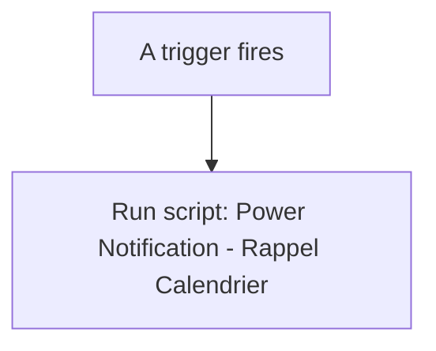
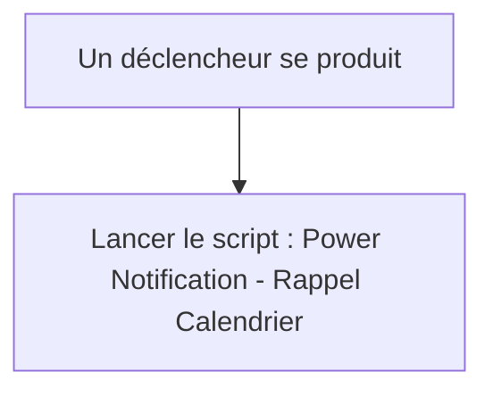

# Rappels - Notifier rappel calendrier / Rappels - Notifier rappel calendrier

## English
- Back to guest-friendly view: [other_background](../../../aspects/other_background.md)
- Back to technical aspect index: [other_background](../other_background.md)

### Summary
- Runs when: A trigger fires
- Only if: No extra conditions
- Then: Run script: Power Notification - Rappel Calendrier

### Scripts called
- [Power Notification - Rappel Calendrier](../../scripts/power_notification_rappel.md)

## Français
- Retour vers la vue “invité” : [other_background](../../../aspects/other_background.md)
- Retour vers l’index technique de l’aspect : [other_background](../other_background.md)

### Résumé
- Se déclenche quand : Un déclencheur se produit
- Uniquement si : Pas de condition supplémentaire
- Ensuite : Lancer le script : Power Notification - Rappel Calendrier

### Scripts appelés
- [Power Notification - Rappel Calendrier](../../scripts/power_notification_rappel.md)

