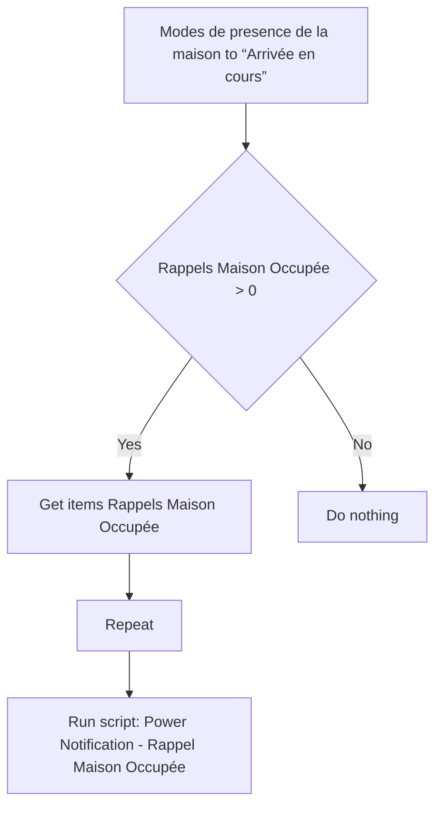
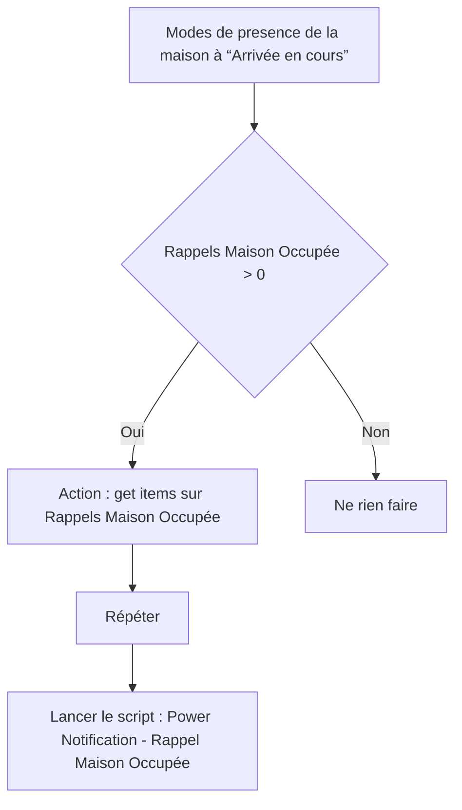

# Rappels - Notifier rappel maison occupée / Rappels - Notifier rappel maison occupée

## English
- Back to guest-friendly view: [other_background](../../../aspects/other_background.md)
- Back to technical aspect index: [other_background](../other_background.md)

### Summary
- Runs when: Modes de presence de la maison to “Arrivée en cours”
- Only if: Rappels Maison Occupée > 0
- Then: Get items Rappels Maison Occupée; Repeat; Run script: Power Notification - Rappel Maison Occupée

### Scripts called
- [Power Notification - Rappel Maison Occupée](../../scripts/power_notification_rappel_maison_occupee.md)

## Français
- Retour vers la vue “invité” : [other_background](../../../aspects/other_background.md)
- Retour vers l’index technique de l’aspect : [other_background](../other_background.md)

### Résumé
- Se déclenche quand : Modes de presence de la maison à “Arrivée en cours”
- Uniquement si : Rappels Maison Occupée > 0
- Ensuite : Action : get items sur Rappels Maison Occupée; Répéter; Lancer le script : Power Notification - Rappel Maison Occupée

### Scripts appelés
- [Power Notification - Rappel Maison Occupée](../../scripts/power_notification_rappel_maison_occupee.md)

