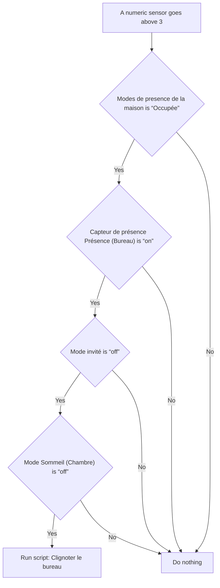

# Bureau - Notification Lumineuse Qualité de l'air / Bureau - Notification Lumineuse Qualité de l'air

## English
- Back to guest-friendly view: [other_background](../../../aspects/other_background.md)
- Back to technical aspect index: [other_background](../other_background.md)

### Summary
- Runs when: A numeric sensor goes above 3
- Only if: Modes de presence de la maison is “Occupée”; Capteur de présence Présence (Bureau) is “on”; Mode invité is “off”; Mode Sommeil (Chambre) is “off”
- Then: Run script: Clignoter le bureau

### Scripts called
- [Clignoter le bureau](../../scripts/clignoter_le_dessous_de_bureau.md)

## Français
- Retour vers la vue “invité” : [other_background](../../../aspects/other_background.md)
- Retour vers l’index technique de l’aspect : [other_background](../other_background.md)

### Résumé
- Se déclenche quand : Un capteur numérique dépasse 3
- Uniquement si : Modes de presence de la maison est “Occupée”; Capteur de présence Présence (Bureau) est “on”; Mode invité est “off”; Mode Sommeil (Chambre) est “off”
- Ensuite : Lancer le script : Clignoter le bureau

### Scripts appelés
- [Clignoter le bureau](../../scripts/clignoter_le_dessous_de_bureau.md)

