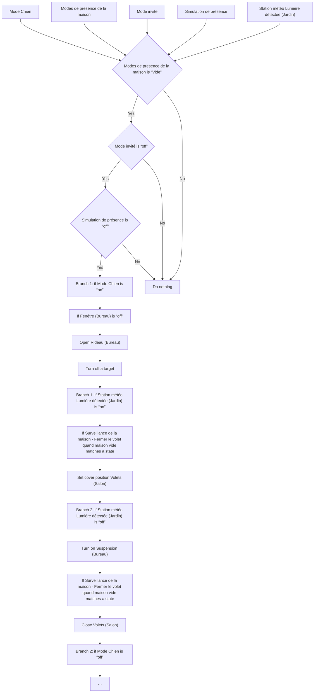
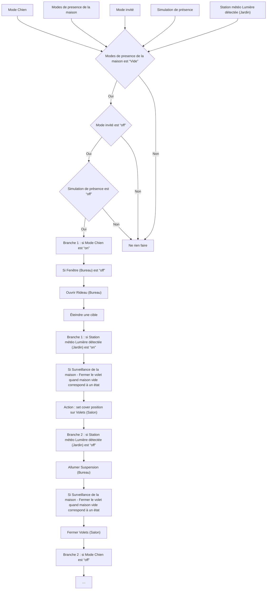

# Mode Chien - Actions / Mode Chien - Actions

## English
- Back to guest-friendly view: [other_background](../../../aspects/other_background.md)
- Back to technical aspect index: [other_background](../other_background.md)

### Summary
- Runs when: Mode Chien; Modes de presence de la maison; Mode invité; Simulation de présence; Station météo Lumière détectée (Jardin)
- Only if: Modes de presence de la maison is “Vide”; Mode invité is “off”; Simulation de présence is “off”
- Then: Branch 1: if Mode Chien is “on”; If Fenêtre (Bureau) is “off”; Open Rideau (Bureau); Turn off a target; Branch 1: if Station météo Lumière détectée (Jardin) is “on”; If Surveillance de la maison - Fermer le volet quand maison vide matches a state; Set cover position Volets (Salon); Branch 2: if Station météo Lumière détectée (Jardin) is “off”; Turn on Suspension (Bureau); If Surveillance de la maison - Fermer le volet quand maison vide matches a state; Close Volets (Salon); Branch 2: if Mode Chien is “off”; …

### Scripts called
- [Éteindre et Sécuriser la maison](../../scripts/leave_home.md)

## Français
- Retour vers la vue “invité” : [other_background](../../../aspects/other_background.md)
- Retour vers l’index technique de l’aspect : [other_background](../other_background.md)

### Résumé
- Se déclenche quand : Mode Chien; Modes de presence de la maison; Mode invité; Simulation de présence; Station météo Lumière détectée (Jardin)
- Uniquement si : Modes de presence de la maison est “Vide”; Mode invité est “off”; Simulation de présence est “off”
- Ensuite : Branche 1 : si Mode Chien est “on”; Si Fenêtre (Bureau) est “off”; Ouvrir Rideau (Bureau); Éteindre une cible; Branche 1 : si Station météo Lumière détectée (Jardin) est “on”; Si Surveillance de la maison - Fermer le volet quand maison vide correspond à un état; Action : set cover position sur Volets (Salon); Branche 2 : si Station météo Lumière détectée (Jardin) est “off”; Allumer Suspension (Bureau); Si Surveillance de la maison - Fermer le volet quand maison vide correspond à un état; Fermer Volets (Salon); Branche 2 : si Mode Chien est “off”; …

### Scripts appelés
- [Éteindre et Sécuriser la maison](../../scripts/leave_home.md)

