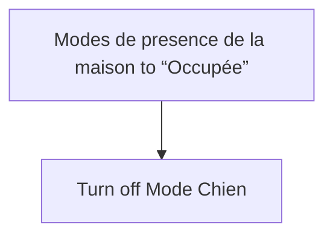
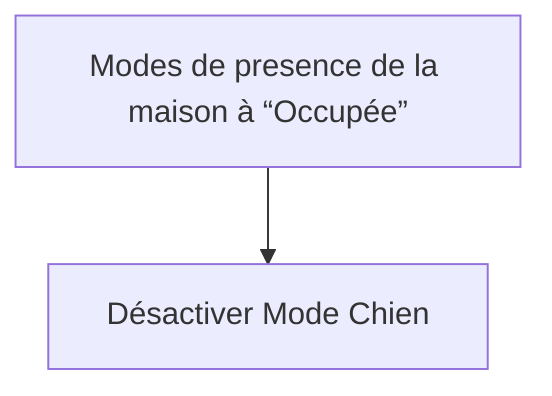

# Mode chien - Désactiver lors du retour a la maison / Mode chien - Désactiver lors du retour a la maison

## English
- Back to guest-friendly view: [other_background](../../../aspects/other_background.md)
- Back to technical aspect index: [other_background](../other_background.md)

### Summary
- Runs when: Modes de presence de la maison to “Occupée”
- Only if: No extra conditions
- Then: Turn off Mode Chien

## Français
- Retour vers la vue “invité” : [other_background](../../../aspects/other_background.md)
- Retour vers l’index technique de l’aspect : [other_background](../other_background.md)

### Résumé
- Se déclenche quand : Modes de presence de la maison à “Occupée”
- Uniquement si : Pas de condition supplémentaire
- Ensuite : Désactiver Mode Chien

