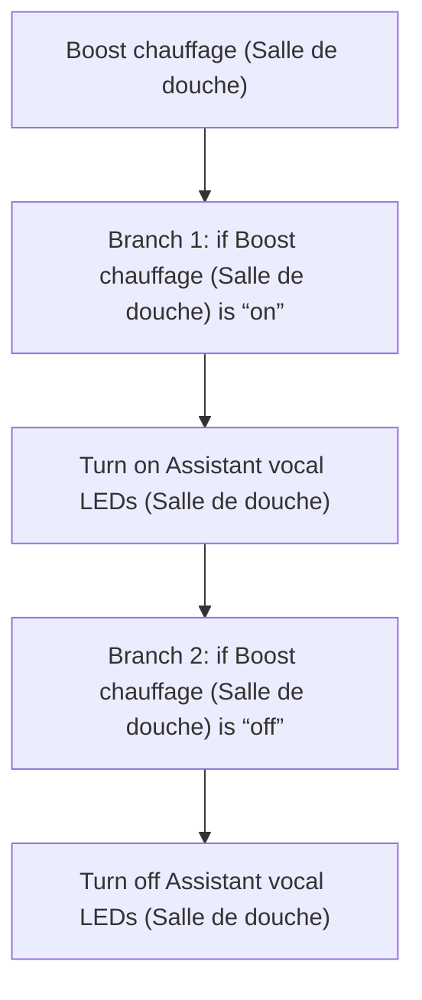
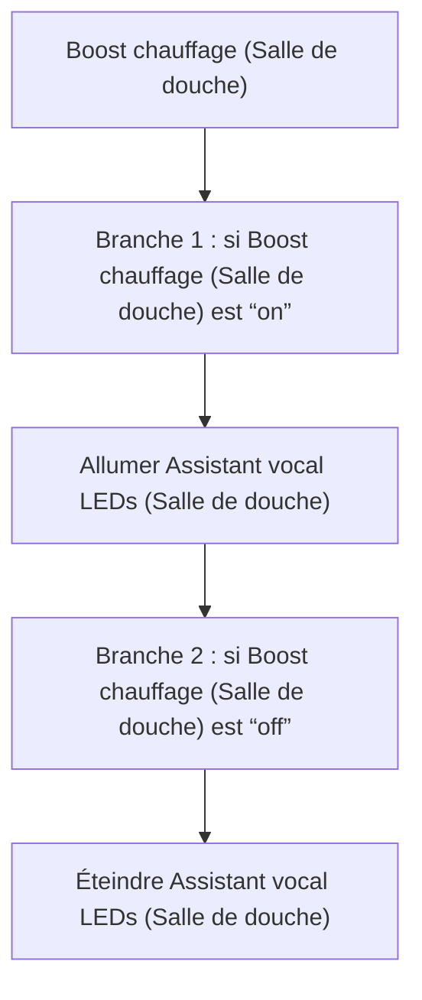

# VPE Douche - Affichage Boost Chauffage / VPE Douche - Affichage Boost Chauffage

## English
- Back to guest-friendly view: [other_background](../../../aspects/other_background.md)
- Back to technical aspect index: [other_background](../other_background.md)

### Summary
- Runs when: Boost chauffage (Salle de douche)
- Only if: No extra conditions
- Then: Branch 1: if Boost chauffage (Salle de douche) is “on”; Turn on Assistant vocal LEDs (Salle de douche); Branch 2: if Boost chauffage (Salle de douche) is “off”; Turn off Assistant vocal LEDs (Salle de douche)

## Français
- Retour vers la vue “invité” : [other_background](../../../aspects/other_background.md)
- Retour vers l’index technique de l’aspect : [other_background](../other_background.md)

### Résumé
- Se déclenche quand : Boost chauffage (Salle de douche)
- Uniquement si : Pas de condition supplémentaire
- Ensuite : Branche 1 : si Boost chauffage (Salle de douche) est “on”; Allumer Assistant vocal LEDs (Salle de douche); Branche 2 : si Boost chauffage (Salle de douche) est “off”; Éteindre Assistant vocal LEDs (Salle de douche)

