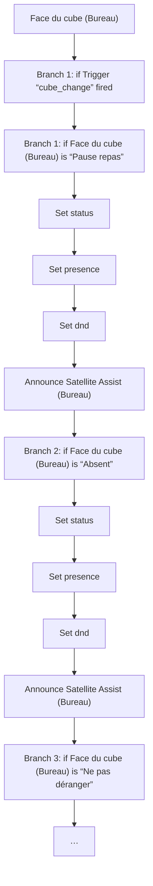
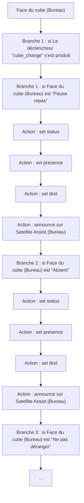

# Slack Status / Slack Status

## English
- Back to guest-friendly view: [other_background](../../../aspects/other_background.md)
- Back to technical aspect index: [other_background](../other_background.md)

### Summary
- Runs when: Face du cube (Bureau)
- Only if: No extra conditions
- Then: Branch 1: if Trigger “cube_change” fired; Branch 1: if Face du cube (Bureau) is “Pause repas”; Set status; Set presence; Set dnd; Announce Satellite Assist (Bureau); Branch 2: if Face du cube (Bureau) is “Absent”; Set status; Set presence; Set dnd; Announce Satellite Assist (Bureau); Branch 3: if Face du cube (Bureau) is “Ne pas déranger”; …

## Français
- Retour vers la vue “invité” : [other_background](../../../aspects/other_background.md)
- Retour vers l’index technique de l’aspect : [other_background](../other_background.md)

### Résumé
- Se déclenche quand : Face du cube (Bureau)
- Uniquement si : Pas de condition supplémentaire
- Ensuite : Branche 1 : si Le déclencheur “cube_change” s’est produit; Branche 1 : si Face du cube (Bureau) est “Pause repas”; Action : set status; Action : set presence; Action : set dnd; Action : announce sur Satellite Assist (Bureau); Branche 2 : si Face du cube (Bureau) est “Absent”; Action : set status; Action : set presence; Action : set dnd; Action : announce sur Satellite Assist (Bureau); Branche 3 : si Face du cube (Bureau) est “Ne pas déranger”; …

