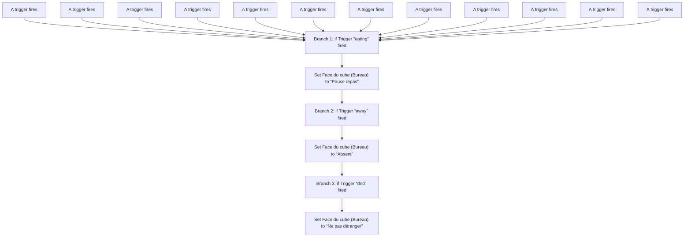
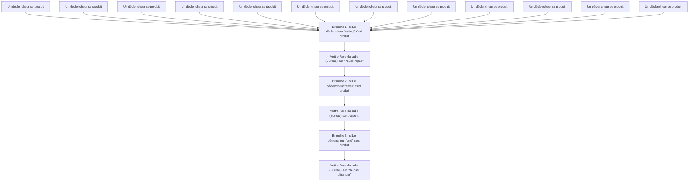

# Changer face du cube / Changer face du cube

## English
- Back to guest-friendly view: [other_background](../../../aspects/other_background.md)
- Back to technical aspect index: [other_background](../other_background.md)

### Summary
- Runs when: A trigger fires; A trigger fires; A trigger fires; A trigger fires; A trigger fires; A trigger fires; A trigger fires; A trigger fires; A trigger fires; A trigger fires; A trigger fires; A trigger fires
- Only if: No extra conditions
- Then: Branch 1: if Trigger “eating” fired; Set Face du cube (Bureau) to “Pause repas”; Branch 2: if Trigger “away” fired; Set Face du cube (Bureau) to “Absent”; Branch 3: if Trigger “dnd” fired; Set Face du cube (Bureau) to “Ne pas déranger”

## Français
- Retour vers la vue “invité” : [other_background](../../../aspects/other_background.md)
- Retour vers l’index technique de l’aspect : [other_background](../other_background.md)

### Résumé
- Se déclenche quand : Un déclencheur se produit; Un déclencheur se produit; Un déclencheur se produit; Un déclencheur se produit; Un déclencheur se produit; Un déclencheur se produit; Un déclencheur se produit; Un déclencheur se produit; Un déclencheur se produit; Un déclencheur se produit; Un déclencheur se produit; Un déclencheur se produit
- Uniquement si : Pas de condition supplémentaire
- Ensuite : Branche 1 : si Le déclencheur “eating” s’est produit; Mettre Face du cube (Bureau) sur “Pause repas”; Branche 2 : si Le déclencheur “away” s’est produit; Mettre Face du cube (Bureau) sur “Absent”; Branche 3 : si Le déclencheur “dnd” s’est produit; Mettre Face du cube (Bureau) sur “Ne pas déranger”

