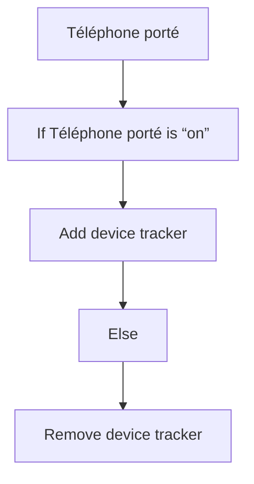
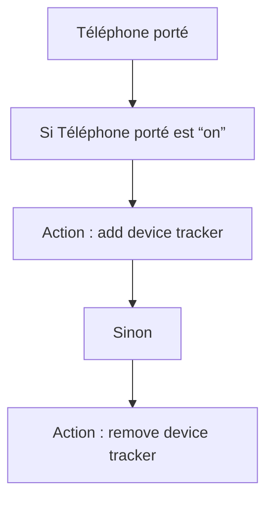

# Appareils personnels - Attacher/Détacher téléphone / Appareils personnels - Attacher/Détacher téléphone

## English
- Back to guest-friendly view: [other_background](../../../aspects/other_background.md)
- Back to technical aspect index: [other_background](../other_background.md)

### Summary
- Runs when: Téléphone porté
- Only if: No extra conditions
- Then: If Téléphone porté is “on”; Add device tracker; Else; Remove device tracker

## Français
- Retour vers la vue “invité” : [other_background](../../../aspects/other_background.md)
- Retour vers l’index technique de l’aspect : [other_background](../other_background.md)

### Résumé
- Se déclenche quand : Téléphone porté
- Uniquement si : Pas de condition supplémentaire
- Ensuite : Si Téléphone porté est “on”; Action : add device tracker; Sinon; Action : remove device tracker

