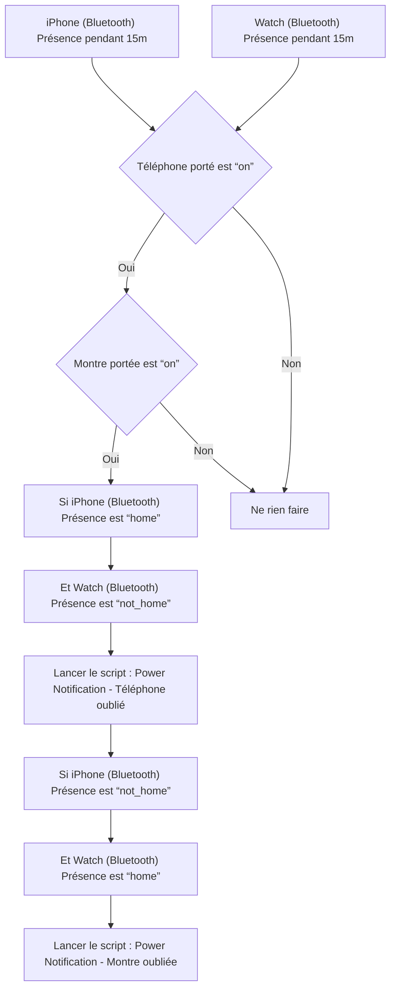

# Appareils personnels - 🔔 Notifier appareil oublié / Appareils personnels - 🔔 Notifier appareil oublié

## English
- Back to guest-friendly view: [other_background](../../../aspects/other_background.md)
- Back to technical aspect index: [other_background](../other_background.md)

### Summary
- Runs when: iPhone (Bluetooth) Présence for 15m; Watch (Bluetooth) Présence for 15m
- Only if: Téléphone porté is “on”; Montre portée is “on”
- Then: If iPhone (Bluetooth) Présence is “home”; And Watch (Bluetooth) Présence is “not_home”; Run script: Power Notification - Téléphone oublié; If iPhone (Bluetooth) Présence is “not_home”; And Watch (Bluetooth) Présence is “home”; Run script: Power Notification - Montre oubliée

### Scripts called
- [Power Notification - Montre oubliée](../../scripts/power_notification_montre_oubliee.md)
- [Power Notification - Téléphone oublié](../../scripts/power_notification_telephone_oublie.md)

## Français
- Retour vers la vue “invité” : [other_background](../../../aspects/other_background.md)
- Retour vers l’index technique de l’aspect : [other_background](../other_background.md)

### Résumé
- Se déclenche quand : iPhone (Bluetooth) Présence pendant 15m; Watch (Bluetooth) Présence pendant 15m
- Uniquement si : Téléphone porté est “on”; Montre portée est “on”
- Ensuite : Si iPhone (Bluetooth) Présence est “home”; Et Watch (Bluetooth) Présence est “not_home”; Lancer le script : Power Notification - Téléphone oublié; Si iPhone (Bluetooth) Présence est “not_home”; Et Watch (Bluetooth) Présence est “home”; Lancer le script : Power Notification - Montre oubliée

### Scripts appelés
- [Power Notification - Montre oubliée](../../scripts/power_notification_montre_oubliee.md)
- [Power Notification - Téléphone oublié](../../scripts/power_notification_telephone_oublie.md)

