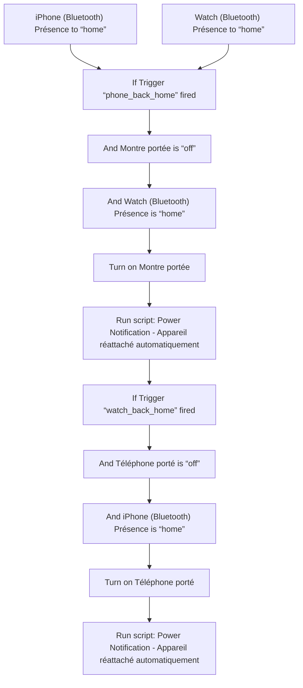
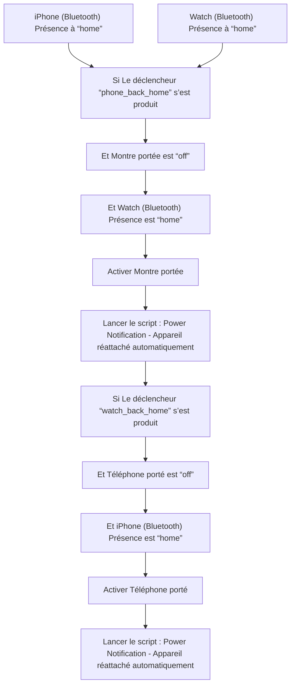

# Appareils personnels - Réattacher automatiquement / Appareils personnels - Réattacher automatiquement

## English
- Back to guest-friendly view: [other_background](../../../aspects/other_background.md)
- Back to technical aspect index: [other_background](../other_background.md)

### Summary
- Runs when: iPhone (Bluetooth) Présence to “home”; Watch (Bluetooth) Présence to “home”
- Only if: No extra conditions
- Then: If Trigger “phone_back_home” fired; And Montre portée is “off”; And Watch (Bluetooth) Présence is “home”; Turn on Montre portée; Run script: Power Notification - Appareil réattaché automatiquement; If Trigger “watch_back_home” fired; And Téléphone porté is “off”; And iPhone (Bluetooth) Présence is “home”; Turn on Téléphone porté; Run script: Power Notification - Appareil réattaché automatiquement

### Scripts called
- [Power Notification - Appareil réattaché automatiquement](../../scripts/power_notification_appareil_reattache_automatiquement.md)

## Français
- Retour vers la vue “invité” : [other_background](../../../aspects/other_background.md)
- Retour vers l’index technique de l’aspect : [other_background](../other_background.md)

### Résumé
- Se déclenche quand : iPhone (Bluetooth) Présence à “home”; Watch (Bluetooth) Présence à “home”
- Uniquement si : Pas de condition supplémentaire
- Ensuite : Si Le déclencheur “phone_back_home” s’est produit; Et Montre portée est “off”; Et Watch (Bluetooth) Présence est “home”; Activer Montre portée; Lancer le script : Power Notification - Appareil réattaché automatiquement; Si Le déclencheur “watch_back_home” s’est produit; Et Téléphone porté est “off”; Et iPhone (Bluetooth) Présence est “home”; Activer Téléphone porté; Lancer le script : Power Notification - Appareil réattaché automatiquement

### Scripts appelés
- [Power Notification - Appareil réattaché automatiquement](../../scripts/power_notification_appareil_reattache_automatiquement.md)

