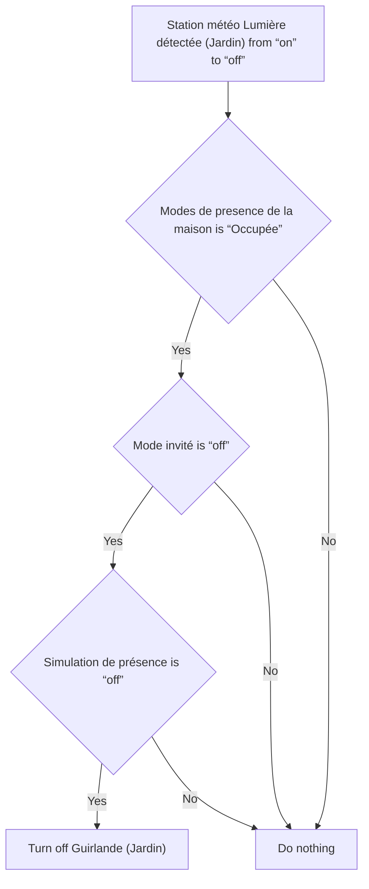
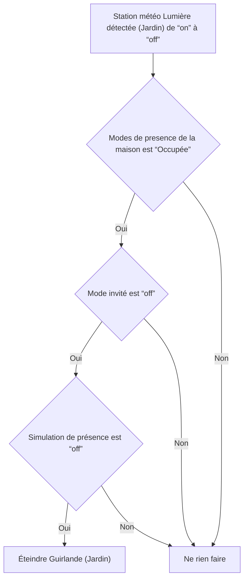

# Guirlande Jardin - Éteindre automatiquement / Guirlande Jardin - Éteindre automatiquement

## English
- Back to guest-friendly view: [other_background](../../../aspects/other_background.md)
- Back to technical aspect index: [other_background](../other_background.md)

### Summary
- Runs when: Station météo Lumière détectée (Jardin) from “on” to “off”
- Only if: Modes de presence de la maison is “Occupée”; Mode invité is “off”; Simulation de présence is “off”
- Then: Turn off Guirlande (Jardin)

## Français
- Retour vers la vue “invité” : [other_background](../../../aspects/other_background.md)
- Retour vers l’index technique de l’aspect : [other_background](../other_background.md)

### Résumé
- Se déclenche quand : Station météo Lumière détectée (Jardin) de “on” à “off”
- Uniquement si : Modes de presence de la maison est “Occupée”; Mode invité est “off”; Simulation de présence est “off”
- Ensuite : Éteindre Guirlande (Jardin)

