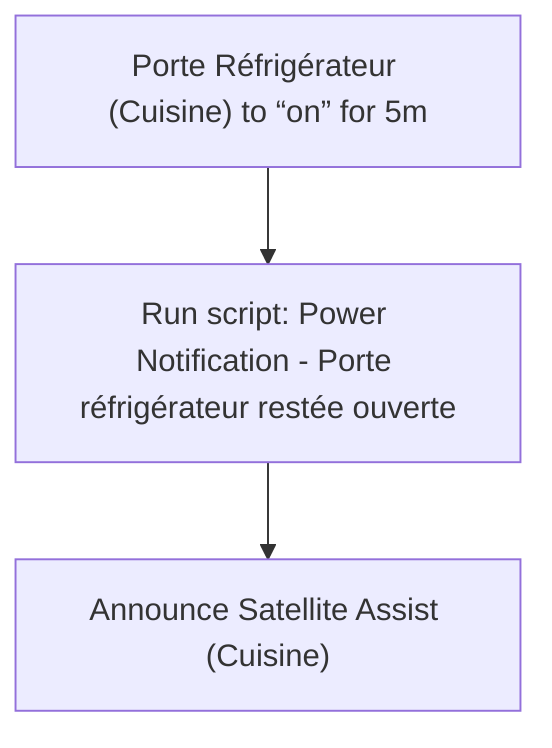
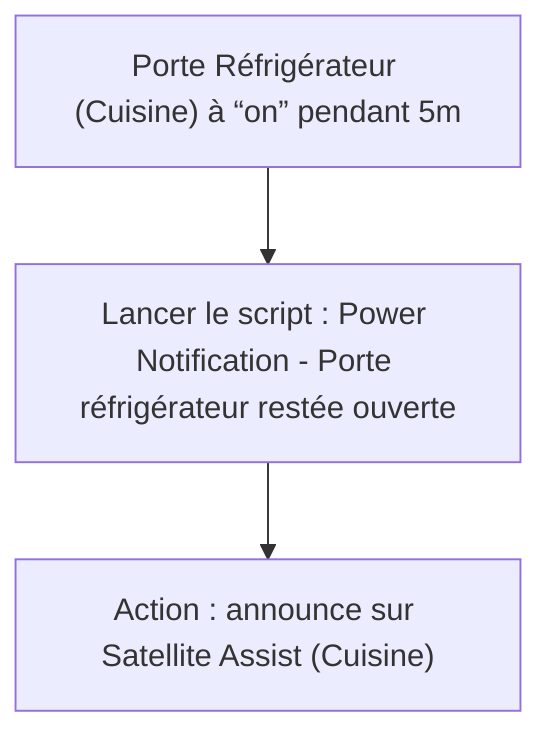

# Frigo - Porte réfrigérateur restée ouverte / Frigo - Porte réfrigérateur restée ouverte

## English
- Back to guest-friendly view: [other_background](../../../aspects/other_background.md)
- Back to technical aspect index: [other_background](../other_background.md)

### Summary
- Runs when: Porte Réfrigérateur (Cuisine) to “on” for 5m
- Only if: No extra conditions
- Then: Run script: Power Notification - Porte réfrigérateur restée ouverte; Announce Satellite Assist (Cuisine)

### Scripts called
- [Power Notification - Porte réfrigérateur restée ouverte](../../scripts/power_notification_porte_refrigerateur_restee_ouverte.md)

## Français
- Retour vers la vue “invité” : [other_background](../../../aspects/other_background.md)
- Retour vers l’index technique de l’aspect : [other_background](../other_background.md)

### Résumé
- Se déclenche quand : Porte Réfrigérateur (Cuisine) à “on” pendant 5m
- Uniquement si : Pas de condition supplémentaire
- Ensuite : Lancer le script : Power Notification - Porte réfrigérateur restée ouverte; Action : announce sur Satellite Assist (Cuisine)

### Scripts appelés
- [Power Notification - Porte réfrigérateur restée ouverte](../../scripts/power_notification_porte_refrigerateur_restee_ouverte.md)

