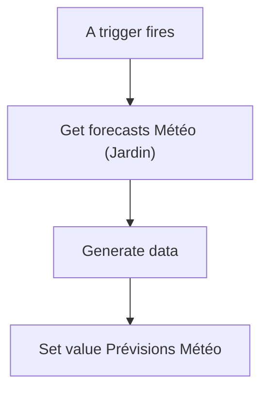
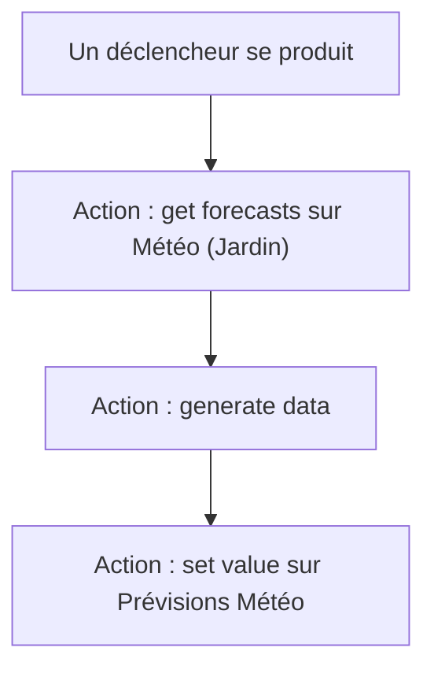

# Dashboard - Prévision météo / Dashboard - Prévision météo

## English
- Back to guest-friendly view: [other_background](../../../aspects/other_background.md)
- Back to technical aspect index: [other_background](../other_background.md)

### Summary
- Runs when: A trigger fires
- Only if: No extra conditions
- Then: Get forecasts Météo (Jardin); Generate data; Set value Prévisions Météo

## Français
- Retour vers la vue “invité” : [other_background](../../../aspects/other_background.md)
- Retour vers l’index technique de l’aspect : [other_background](../other_background.md)

### Résumé
- Se déclenche quand : Un déclencheur se produit
- Uniquement si : Pas de condition supplémentaire
- Ensuite : Action : get forecasts sur Météo (Jardin); Action : generate data; Action : set value sur Prévisions Météo

