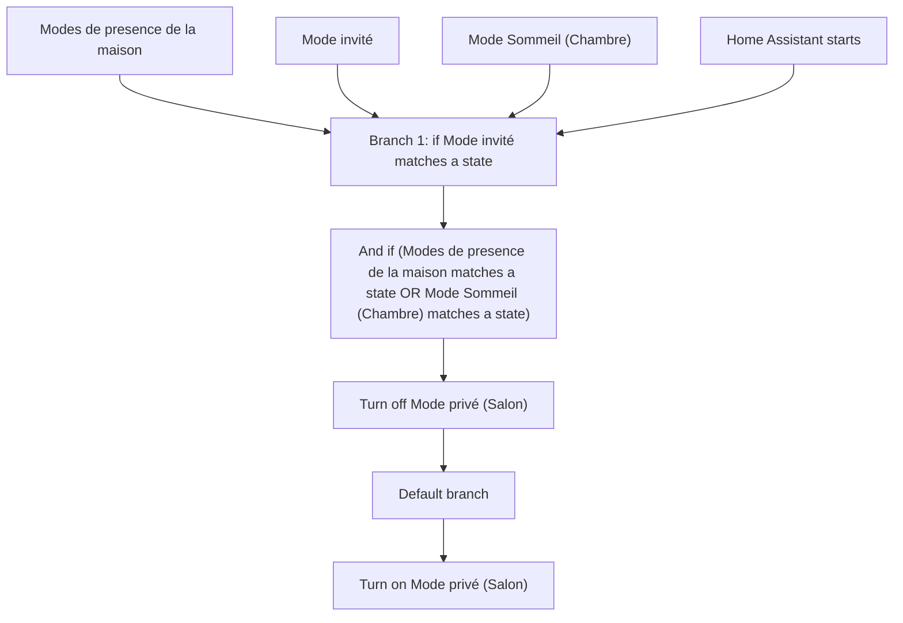
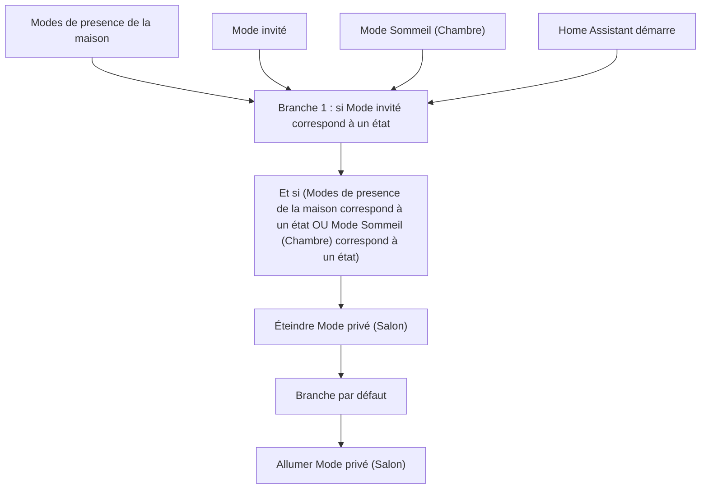

# Camera Salon: Privacy Mode / Camera Salon: Privacy Mode

## English
- Back to guest-friendly view: [other_background](../../../aspects/other_background.md)
- Back to technical aspect index: [other_background](../other_background.md)

### Summary
- Runs when: Modes de presence de la maison; Mode invité; Mode Sommeil (Chambre); Home Assistant starts
- Only if: No extra conditions
- Then: Branch 1: if Mode invité matches a state; And if (Modes de presence de la maison matches a state OR Mode Sommeil (Chambre) matches a state); Turn off Mode privé (Salon); Default branch; Turn on Mode privé (Salon)

## Français
- Retour vers la vue “invité” : [other_background](../../../aspects/other_background.md)
- Retour vers l’index technique de l’aspect : [other_background](../other_background.md)

### Résumé
- Se déclenche quand : Modes de presence de la maison; Mode invité; Mode Sommeil (Chambre); Home Assistant démarre
- Uniquement si : Pas de condition supplémentaire
- Ensuite : Branche 1 : si Mode invité correspond à un état; Et si (Modes de presence de la maison correspond à un état OU Mode Sommeil (Chambre) correspond à un état); Éteindre Mode privé (Salon); Branche par défaut; Allumer Mode privé (Salon)

