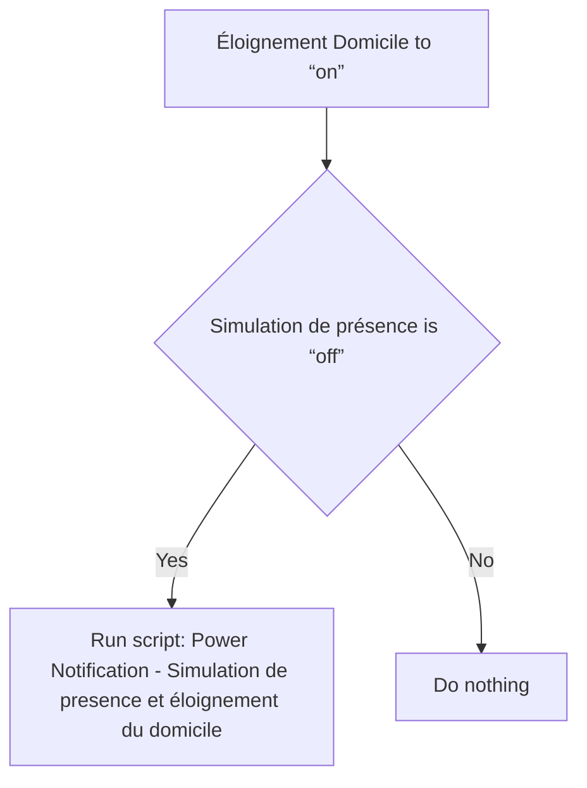
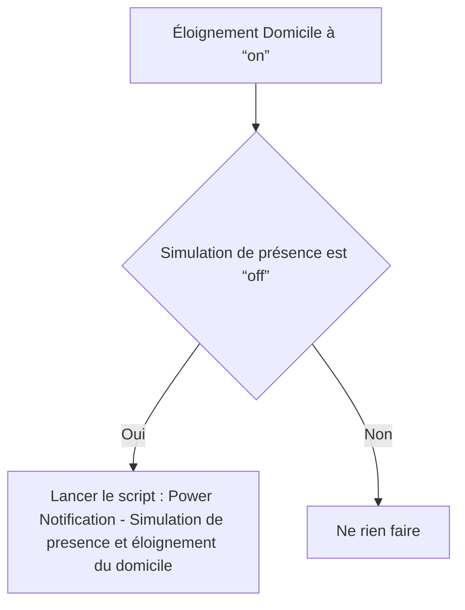

# Simulation de présence - 🛎️ Notifier Éloignement domicile sans simulation de présence / Simulation de présence - 🛎️ Notifier Éloignement domicile sans simulation de présence

## English
- Back to guest-friendly view: [presence_simulation](../../../aspects/presence_simulation.md)
- Back to technical aspect index: [presence_simulation](../presence_simulation.md)

### Summary
- Runs when: Éloignement Domicile to “on”
- Only if: Simulation de présence is “off”
- Then: Run script: Power Notification - Simulation de presence et éloignement du domicile

### Scripts called
- [Power Notification - Simulation de presence et éloignement du domicile](../../scripts/power_notification_simulation_de_presence_et_eloignement_du_domicile.md)

## Français
- Retour vers la vue “invité” : [presence_simulation](../../../aspects/presence_simulation.md)
- Retour vers l’index technique de l’aspect : [presence_simulation](../presence_simulation.md)

### Résumé
- Se déclenche quand : Éloignement Domicile à “on”
- Uniquement si : Simulation de présence est “off”
- Ensuite : Lancer le script : Power Notification - Simulation de presence et éloignement du domicile

### Scripts appelés
- [Power Notification - Simulation de presence et éloignement du domicile](../../scripts/power_notification_simulation_de_presence_et_eloignement_du_domicile.md)

