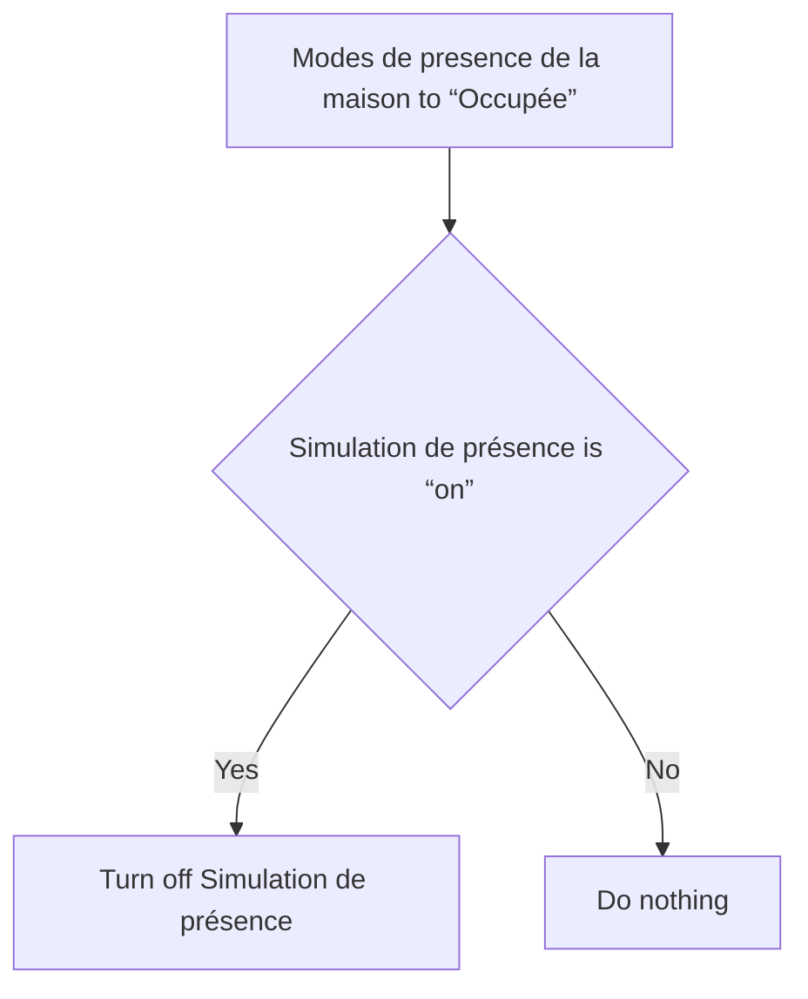

# Simulation de présence - Arrêter lors du retour / Simulation de présence - Arrêter lors du retour

## English
- Back to guest-friendly view: [presence_simulation](../../../aspects/presence_simulation.md)
- Back to technical aspect index: [presence_simulation](../presence_simulation.md)

### Summary
- Runs when: Modes de presence de la maison to “Occupée”
- Only if: Simulation de présence is “on”
- Then: Turn off Simulation de présence

## Français
- Retour vers la vue “invité” : [presence_simulation](../../../aspects/presence_simulation.md)
- Retour vers l’index technique de l’aspect : [presence_simulation](../presence_simulation.md)

### Résumé
- Se déclenche quand : Modes de presence de la maison à “Occupée”
- Uniquement si : Simulation de présence est “on”
- Ensuite : Désactiver Simulation de présence

