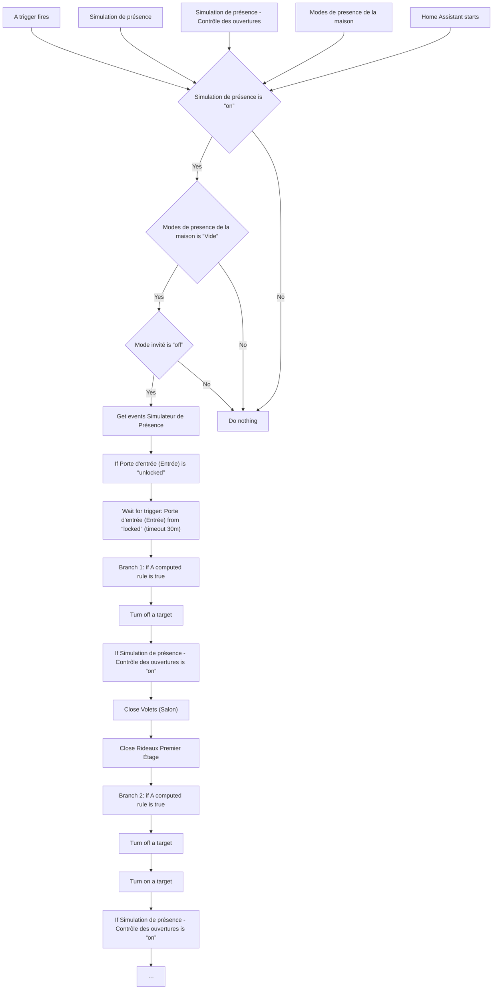
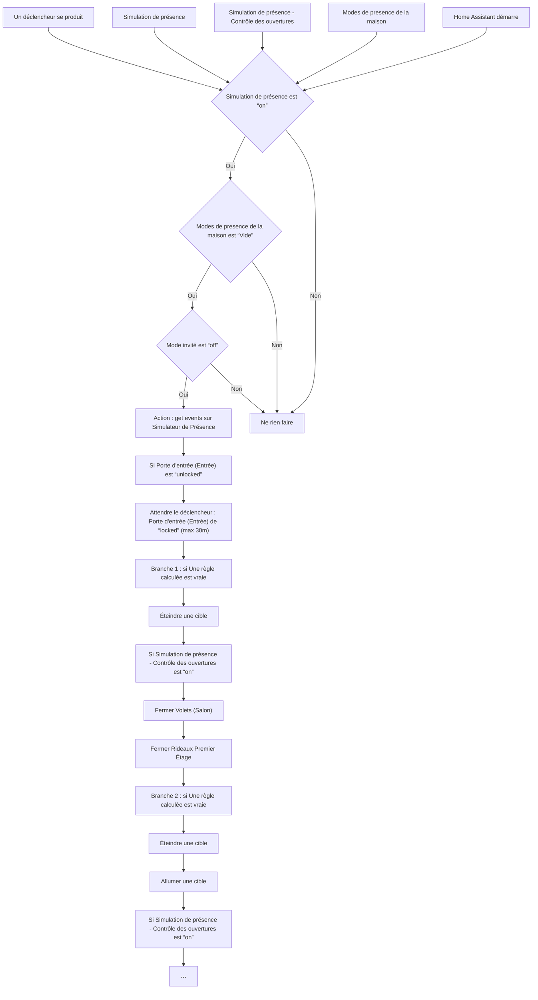

# Simulation de présence / Simulation de présence

## English
- Back to guest-friendly view: [presence_simulation](../../../aspects/presence_simulation.md)
- Back to technical aspect index: [presence_simulation](../presence_simulation.md)

### Summary
- Runs when: A trigger fires; Simulation de présence; Simulation de présence - Contrôle des ouvertures; Modes de presence de la maison; Home Assistant starts
- Only if: Simulation de présence is “on”; Modes de presence de la maison is “Vide”; Mode invité is “off”
- Then: Get events Simulateur de Présence; If Porte d'entrée (Entrée) is “unlocked”; Wait for trigger: Porte d'entrée (Entrée) from “locked” (timeout 30m); Branch 1: if A computed rule is true; Turn off a target; If Simulation de présence - Contrôle des ouvertures is “on”; Close Volets (Salon); Close Rideaux Premier Étage; Branch 2: if A computed rule is true; Turn off a target; Turn on a target; If Simulation de présence - Contrôle des ouvertures is “on”; Branch 3: if A computed rule is true; …

## Français
- Retour vers la vue “invité” : [presence_simulation](../../../aspects/presence_simulation.md)
- Retour vers l’index technique de l’aspect : [presence_simulation](../presence_simulation.md)

### Résumé
- Se déclenche quand : Un déclencheur se produit; Simulation de présence; Simulation de présence - Contrôle des ouvertures; Modes de presence de la maison; Home Assistant démarre
- Uniquement si : Simulation de présence est “on”; Modes de presence de la maison est “Vide”; Mode invité est “off”
- Ensuite : Action : get events sur Simulateur de Présence; Si Porte d'entrée (Entrée) est “unlocked”; Attendre le déclencheur : Porte d'entrée (Entrée) de “locked” (max 30m); Branche 1 : si Une règle calculée est vraie; Éteindre une cible; Si Simulation de présence - Contrôle des ouvertures est “on”; Fermer Volets (Salon); Fermer Rideaux Premier Étage; Branche 2 : si Une règle calculée est vraie; Éteindre une cible; Allumer une cible; Si Simulation de présence - Contrôle des ouvertures est “on”; Branche 3 : si Une règle calculée est vraie; …

