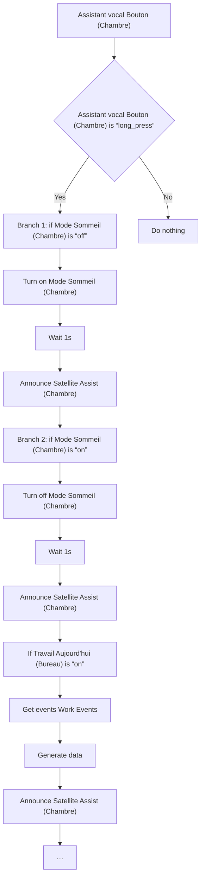
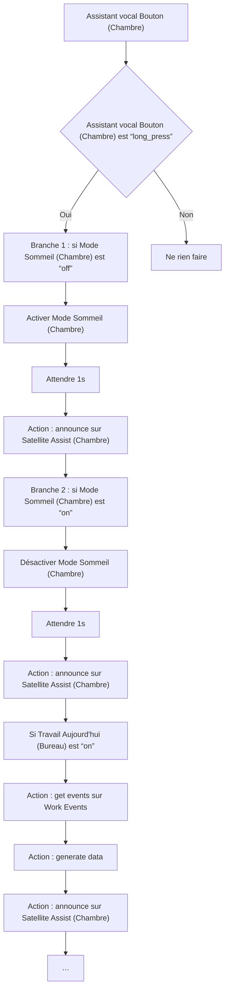

# Mode Sommeil - Bascule par VoiceKit Chambre / Mode Sommeil - Bascule par VoiceKit Chambre

## English
- Back to guest-friendly view: [sleep_mode](../../../aspects/sleep_mode.md)
- Back to technical aspect index: [sleep_mode](../sleep_mode.md)

### Summary
- Runs when: Assistant vocal Bouton (Chambre)
- Only if: Assistant vocal Bouton (Chambre) is “long_press”
- Then: Branch 1: if Mode Sommeil (Chambre) is “off”; Turn on Mode Sommeil (Chambre); Wait 1s; Announce Satellite Assist (Chambre); Branch 2: if Mode Sommeil (Chambre) is “on”; Turn off Mode Sommeil (Chambre); Wait 1s; Announce Satellite Assist (Chambre); If Travail Aujourd'hui (Bureau) is “on”; Get events Work Events; Generate data; Announce Satellite Assist (Chambre); …

## Français
- Retour vers la vue “invité” : [sleep_mode](../../../aspects/sleep_mode.md)
- Retour vers l’index technique de l’aspect : [sleep_mode](../sleep_mode.md)

### Résumé
- Se déclenche quand : Assistant vocal Bouton (Chambre)
- Uniquement si : Assistant vocal Bouton (Chambre) est “long_press”
- Ensuite : Branche 1 : si Mode Sommeil (Chambre) est “off”; Activer Mode Sommeil (Chambre); Attendre 1s; Action : announce sur Satellite Assist (Chambre); Branche 2 : si Mode Sommeil (Chambre) est “on”; Désactiver Mode Sommeil (Chambre); Attendre 1s; Action : announce sur Satellite Assist (Chambre); Si Travail Aujourd'hui (Bureau) est “on”; Action : get events sur Work Events; Action : generate data; Action : announce sur Satellite Assist (Chambre); …

