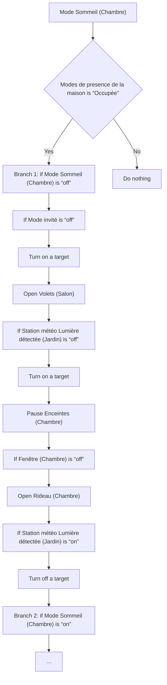
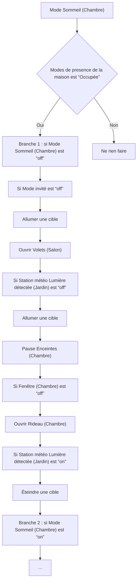

# Mode Sommeil - Actions / Mode Sommeil - Actions

## English
- Back to guest-friendly view: [sleep_mode](../../../aspects/sleep_mode.md)
- Back to technical aspect index: [sleep_mode](../sleep_mode.md)

### Summary
- Runs when: Mode Sommeil (Chambre)
- Only if: Modes de presence de la maison is “Occupée”
- Then: Branch 1: if Mode Sommeil (Chambre) is “off”; If Mode invité is “off”; Turn on a target; Open Volets (Salon); If Station météo Lumière détectée (Jardin) is “off”; Turn on a target; Pause Enceintes (Chambre); If Fenêtre (Chambre) is “off”; Open Rideau (Chambre); If Station météo Lumière détectée (Jardin) is “on”; Turn off a target; Branch 2: if Mode Sommeil (Chambre) is “on”; …

### Scripts called
- [Éteindre tous les lecteurs multimédia](../../scripts/eteindre_tous_les_lecteur_multimedia.md)
- [Power Notification - Porte d'entrée ouverte lors du coucher](../../scripts/power_notification_porte_d_entree_ouverte_lors_du_coucher.md)

## Français
- Retour vers la vue “invité” : [sleep_mode](../../../aspects/sleep_mode.md)
- Retour vers l’index technique de l’aspect : [sleep_mode](../sleep_mode.md)

### Résumé
- Se déclenche quand : Mode Sommeil (Chambre)
- Uniquement si : Modes de presence de la maison est “Occupée”
- Ensuite : Branche 1 : si Mode Sommeil (Chambre) est “off”; Si Mode invité est “off”; Allumer une cible; Ouvrir Volets (Salon); Si Station météo Lumière détectée (Jardin) est “off”; Allumer une cible; Pause Enceintes (Chambre); Si Fenêtre (Chambre) est “off”; Ouvrir Rideau (Chambre); Si Station météo Lumière détectée (Jardin) est “on”; Éteindre une cible; Branche 2 : si Mode Sommeil (Chambre) est “on”; …

### Scripts appelés
- [Éteindre tous les lecteurs multimédia](../../scripts/eteindre_tous_les_lecteur_multimedia.md)
- [Power Notification - Porte d'entrée ouverte lors du coucher](../../scripts/power_notification_porte_d_entree_ouverte_lors_du_coucher.md)

