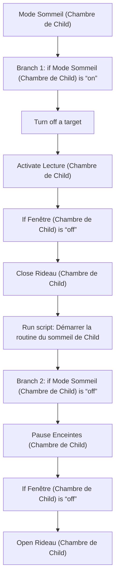
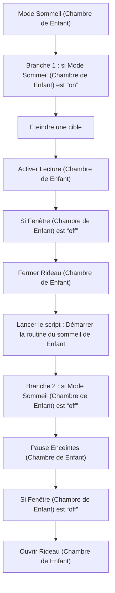

# Mode Sommeil Child - Actions / Mode Sommeil Enfant - Actions

## English
- Back to guest-friendly view: [sleep_mode](../../../aspects/sleep_mode.md)
- Back to technical aspect index: [sleep_mode](../sleep_mode.md)

### Summary
- Runs when: Mode Sommeil (Chambre de Child)
- Only if: No extra conditions
- Then: Branch 1: if Mode Sommeil (Chambre de Child) is “on”; Turn off a target; Activate Lecture (Chambre de Child); If Fenêtre (Chambre de Child) is “off”; Close Rideau (Chambre de Child); Run script: Démarrer la routine du sommeil de Child; Branch 2: if Mode Sommeil (Chambre de Child) is “off”; Pause Enceintes (Chambre de Child); If Fenêtre (Chambre de Child) is “off”; Open Rideau (Chambre de Child)

### Scripts called
- [Démarrer la routine du sommeil de Child](../../scripts/start_child_bedtime_routine.md)

## Français
- Retour vers la vue “invité” : [sleep_mode](../../../aspects/sleep_mode.md)
- Retour vers l’index technique de l’aspect : [sleep_mode](../sleep_mode.md)

### Résumé
- Se déclenche quand : Mode Sommeil (Chambre de Enfant)
- Uniquement si : Pas de condition supplémentaire
- Ensuite : Branche 1 : si Mode Sommeil (Chambre de Enfant) est “on”; Éteindre une cible; Activer Lecture (Chambre de Enfant); Si Fenêtre (Chambre de Enfant) est “off”; Fermer Rideau (Chambre de Enfant); Lancer le script : Démarrer la routine du sommeil de Enfant; Branche 2 : si Mode Sommeil (Chambre de Enfant) est “off”; Pause Enceintes (Chambre de Enfant); Si Fenêtre (Chambre de Enfant) est “off”; Ouvrir Rideau (Chambre de Enfant)

### Scripts appelés
- [Démarrer la routine du sommeil de Enfant](../../scripts/start_child_bedtime_routine.md)

