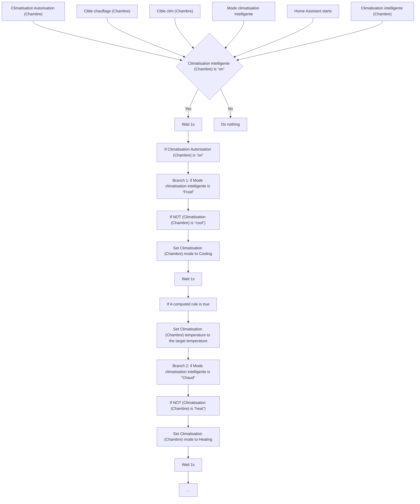
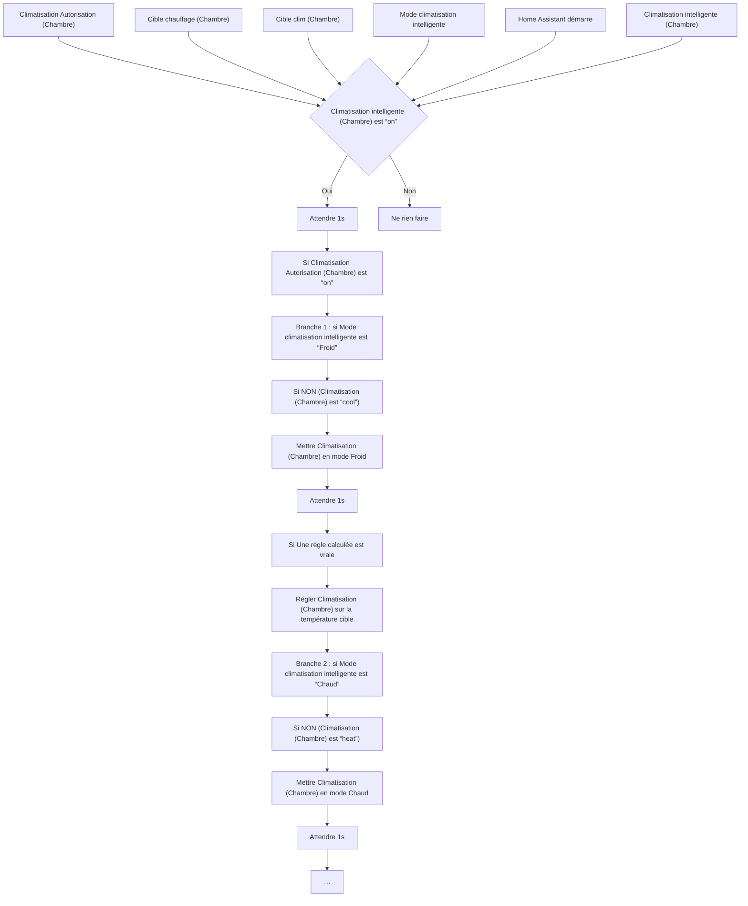

# Climatisation Intelligente - Chambre / Climatisation Intelligente - Chambre

## English
- Back to guest-friendly view: [smart_air_conditioning](../../../aspects/smart_air_conditioning.md)
- Back to technical aspect index: [smart_air_conditioning](../smart_air_conditioning.md)

### Summary
- Runs when: Climatisation Autorisation (Chambre); Cible chauffage (Chambre); Cible clim (Chambre); Mode climatisation intelligente; Home Assistant starts; Climatisation intelligente (Chambre)
- Only if: Climatisation intelligente (Chambre) is “on”
- Then: Wait 1s; If Climatisation Autorisation (Chambre) is “on”; Branch 1: if Mode climatisation intelligente is “Froid”; If NOT (Climatisation (Chambre) is “cool”); Set Climatisation (Chambre) mode to Cooling; Wait 1s; If A computed rule is true; Set Climatisation (Chambre) temperature to the target temperature; Branch 2: if Mode climatisation intelligente is “Chaud”; If NOT (Climatisation (Chambre) is “heat”); Set Climatisation (Chambre) mode to Heating; Wait 1s; …

## Français
- Retour vers la vue “invité” : [smart_air_conditioning](../../../aspects/smart_air_conditioning.md)
- Retour vers l’index technique de l’aspect : [smart_air_conditioning](../smart_air_conditioning.md)

### Résumé
- Se déclenche quand : Climatisation Autorisation (Chambre); Cible chauffage (Chambre); Cible clim (Chambre); Mode climatisation intelligente; Home Assistant démarre; Climatisation intelligente (Chambre)
- Uniquement si : Climatisation intelligente (Chambre) est “on”
- Ensuite : Attendre 1s; Si Climatisation Autorisation (Chambre) est “on”; Branche 1 : si Mode climatisation intelligente est “Froid”; Si NON (Climatisation (Chambre) est “cool”); Mettre Climatisation (Chambre) en mode Froid; Attendre 1s; Si Une règle calculée est vraie; Régler Climatisation (Chambre) sur la température cible; Branche 2 : si Mode climatisation intelligente est “Chaud”; Si NON (Climatisation (Chambre) est “heat”); Mettre Climatisation (Chambre) en mode Chaud; Attendre 1s; …

