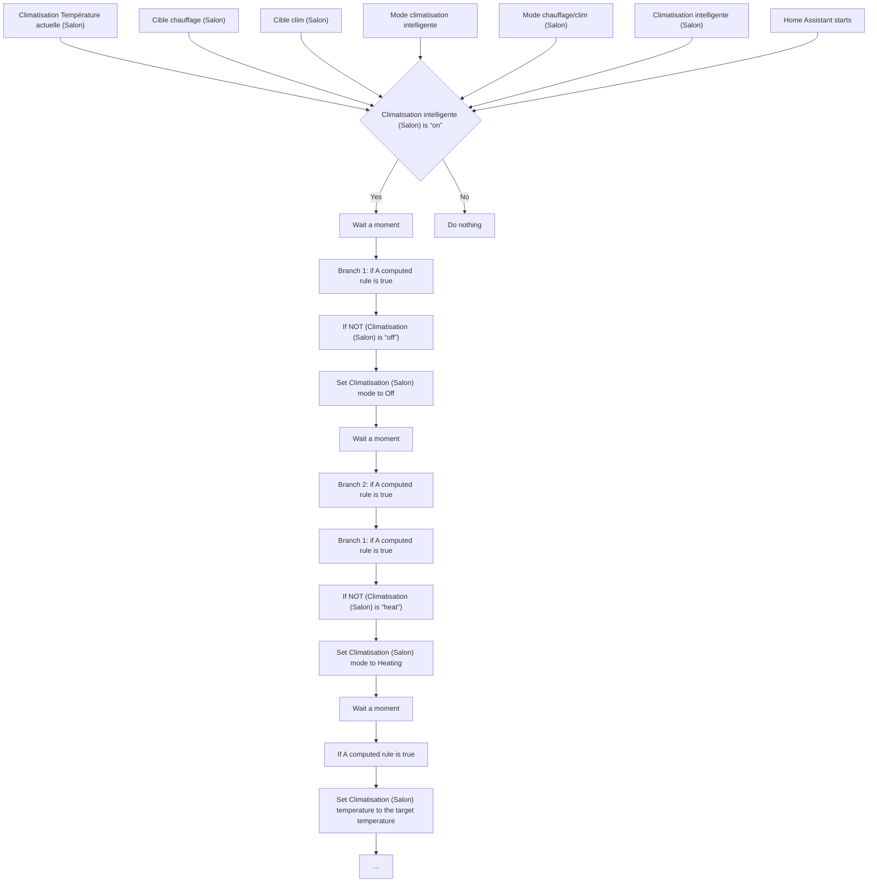
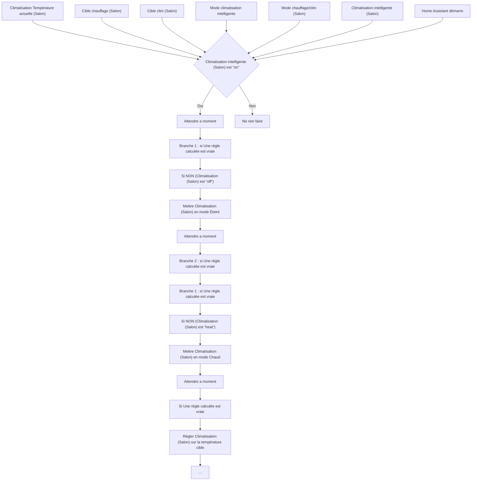

# Climatisation Intelligente - Rez-de-chaussée / Climatisation Intelligente - Rez-de-chaussée

## English
- Back to guest-friendly view: [smart_air_conditioning](../../../aspects/smart_air_conditioning.md)
- Back to technical aspect index: [smart_air_conditioning](../smart_air_conditioning.md)

### Summary
- Runs when: Climatisation Température actuelle (Salon); Cible chauffage (Salon); Cible clim (Salon); Mode climatisation intelligente; Mode chauffage/clim (Salon); Climatisation intelligente (Salon); Home Assistant starts
- Only if: Climatisation intelligente (Salon) is “on”
- Then: Wait a moment; Branch 1: if A computed rule is true; If NOT (Climatisation (Salon) is “off”); Set Climatisation (Salon) mode to Off; Wait a moment; Branch 2: if A computed rule is true; Branch 1: if A computed rule is true; If NOT (Climatisation (Salon) is “heat”); Set Climatisation (Salon) mode to Heating; Wait a moment; If A computed rule is true; Set Climatisation (Salon) temperature to the target temperature; Branch 2: if A computed rule is true; Branch 3: if A computed rule is true; …

## Français
- Retour vers la vue “invité” : [smart_air_conditioning](../../../aspects/smart_air_conditioning.md)
- Retour vers l’index technique de l’aspect : [smart_air_conditioning](../smart_air_conditioning.md)

### Résumé
- Se déclenche quand : Climatisation Température actuelle (Salon); Cible chauffage (Salon); Cible clim (Salon); Mode climatisation intelligente; Mode chauffage/clim (Salon); Climatisation intelligente (Salon); Home Assistant démarre
- Uniquement si : Climatisation intelligente (Salon) est “on”
- Ensuite : Attendre a moment; Branche 1 : si Une règle calculée est vraie; Si NON (Climatisation (Salon) est “off”); Mettre Climatisation (Salon) en mode Éteint; Attendre a moment; Branche 2 : si Une règle calculée est vraie; Branche 1 : si Une règle calculée est vraie; Si NON (Climatisation (Salon) est “heat”); Mettre Climatisation (Salon) en mode Chaud; Attendre a moment; Si Une règle calculée est vraie; Régler Climatisation (Salon) sur la température cible; Branche 2 : si Une règle calculée est vraie; Branche 3 : si Une règle calculée est vraie; …

