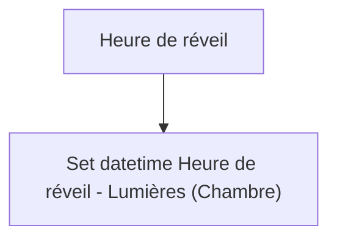
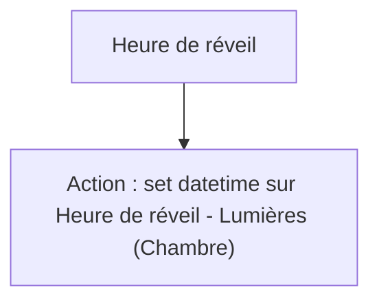

# Réveil intelligent - Régler heures de déclenchement / Réveil intelligent - Régler heures de déclenchement

## English
- Back to guest-friendly view: [smart_alarm_clock](../../../aspects/smart_alarm_clock.md)
- Back to technical aspect index: [smart_alarm_clock](../smart_alarm_clock.md)

### Summary
- Runs when: Heure de réveil
- Only if: No extra conditions
- Then: Set datetime Heure de réveil - Lumières (Chambre)

## Français
- Retour vers la vue “invité” : [smart_alarm_clock](../../../aspects/smart_alarm_clock.md)
- Retour vers l’index technique de l’aspect : [smart_alarm_clock](../smart_alarm_clock.md)

### Résumé
- Se déclenche quand : Heure de réveil
- Uniquement si : Pas de condition supplémentaire
- Ensuite : Action : set datetime sur Heure de réveil - Lumières (Chambre)

