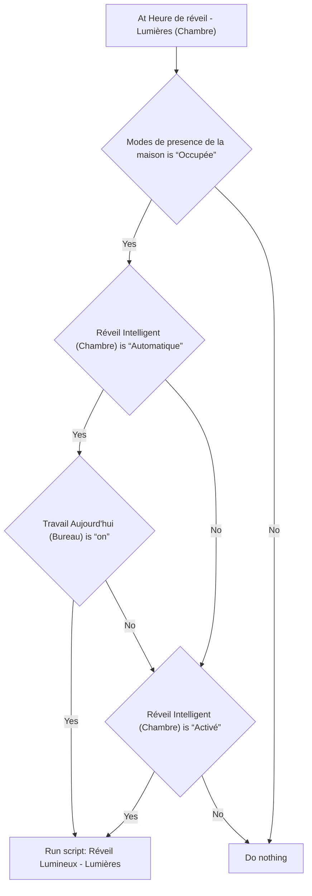
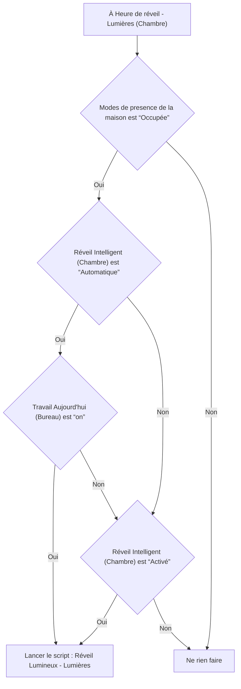

# Réveil intelligent - Allumer Lumières / Réveil intelligent - Allumer Lumières

## English
- Back to guest-friendly view: [smart_alarm_clock](../../../aspects/smart_alarm_clock.md)
- Back to technical aspect index: [smart_alarm_clock](../smart_alarm_clock.md)

### Summary
- Runs when: At Heure de réveil - Lumières (Chambre)
- Only if: Modes de presence de la maison is “Occupée”; ((Réveil Intelligent (Chambre) is “Automatique” AND Travail Aujourd'hui (Bureau) is “on”) OR Réveil Intelligent (Chambre) is “Activé”)
- Then: Run script: Réveil Lumineux - Lumières

### Scripts called
- [Réveil Lumineux - Lumières](../../scripts/wake_up.md)

## Français
- Retour vers la vue “invité” : [smart_alarm_clock](../../../aspects/smart_alarm_clock.md)
- Retour vers l’index technique de l’aspect : [smart_alarm_clock](../smart_alarm_clock.md)

### Résumé
- Se déclenche quand : À Heure de réveil - Lumières (Chambre)
- Uniquement si : Modes de presence de la maison est “Occupée”; ((Réveil Intelligent (Chambre) est “Automatique” ET Travail Aujourd'hui (Bureau) est “on”) OU Réveil Intelligent (Chambre) est “Activé”)
- Ensuite : Lancer le script : Réveil Lumineux - Lumières

### Scripts appelés
- [Réveil Lumineux - Lumières](../../scripts/wake_up.md)

