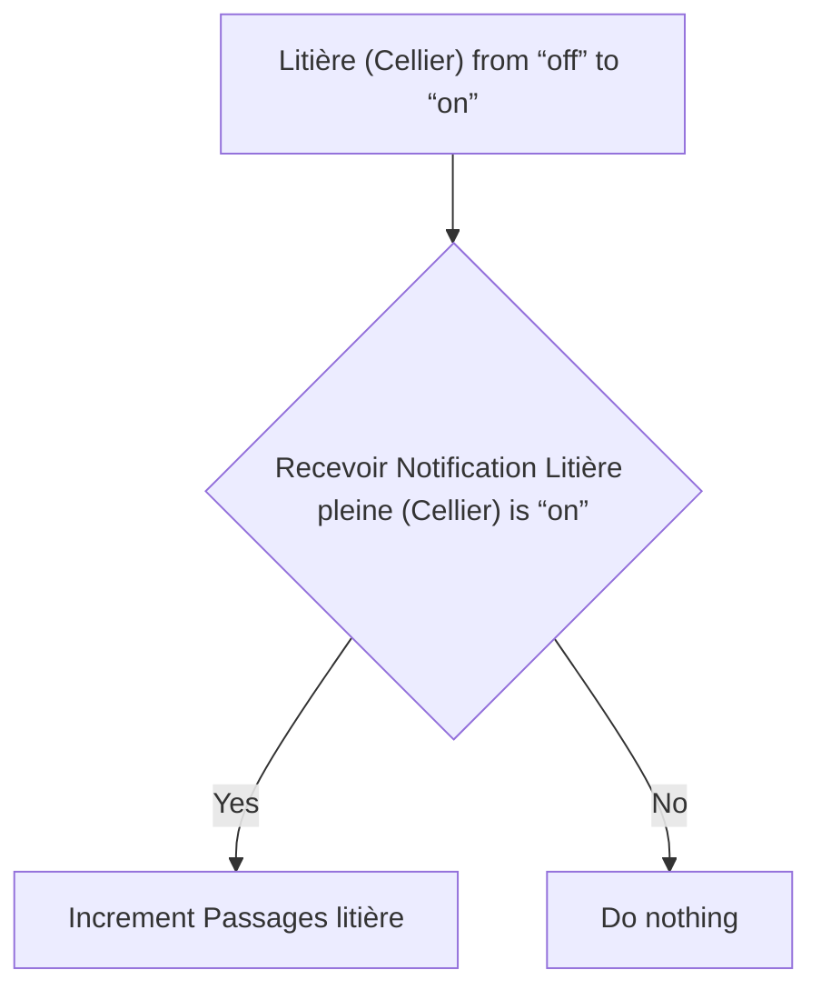
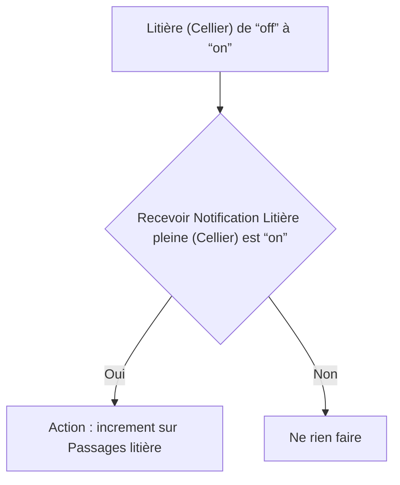

# Litière Intelligente - Incrementer passages litière / Litière Intelligente - Incrementer passages litière

## English
- Back to guest-friendly view: [smart_cat_litter](../../../aspects/smart_cat_litter.md)
- Back to technical aspect index: [smart_cat_litter](../smart_cat_litter.md)

### Summary
- Runs when: Litière (Cellier) from “off” to “on”
- Only if: Recevoir Notification Litière pleine (Cellier) is “on”
- Then: Increment Passages litière

## Français
- Retour vers la vue “invité” : [smart_cat_litter](../../../aspects/smart_cat_litter.md)
- Retour vers l’index technique de l’aspect : [smart_cat_litter](../smart_cat_litter.md)

### Résumé
- Se déclenche quand : Litière (Cellier) de “off” à “on”
- Uniquement si : Recevoir Notification Litière pleine (Cellier) est “on”
- Ensuite : Action : increment sur Passages litière

