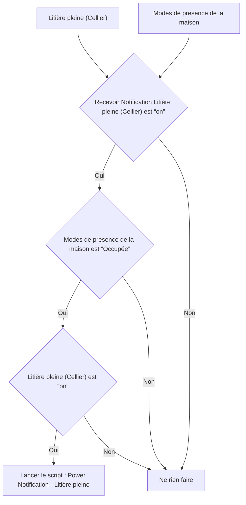

# Litière Intelligente - 🔔 Notifier litière pleine / Litière Intelligente - 🔔 Notifier litière pleine

## English
- Back to guest-friendly view: [smart_cat_litter](../../../aspects/smart_cat_litter.md)
- Back to technical aspect index: [smart_cat_litter](../smart_cat_litter.md)

### Summary
- Runs when: Litière pleine (Cellier); Modes de presence de la maison
- Only if: Recevoir Notification Litière pleine (Cellier) is “on”; Modes de presence de la maison is “Occupée”; Litière pleine (Cellier) is “on”
- Then: Run script: Power Notification - Litière pleine

### Scripts called
- [Power Notification - Litière pleine](../../scripts/power_notification_litiere_pleine.md)

## Français
- Retour vers la vue “invité” : [smart_cat_litter](../../../aspects/smart_cat_litter.md)
- Retour vers l’index technique de l’aspect : [smart_cat_litter](../smart_cat_litter.md)

### Résumé
- Se déclenche quand : Litière pleine (Cellier); Modes de presence de la maison
- Uniquement si : Recevoir Notification Litière pleine (Cellier) est “on”; Modes de presence de la maison est “Occupée”; Litière pleine (Cellier) est “on”
- Ensuite : Lancer le script : Power Notification - Litière pleine

### Scripts appelés
- [Power Notification - Litière pleine](../../scripts/power_notification_litiere_pleine.md)

