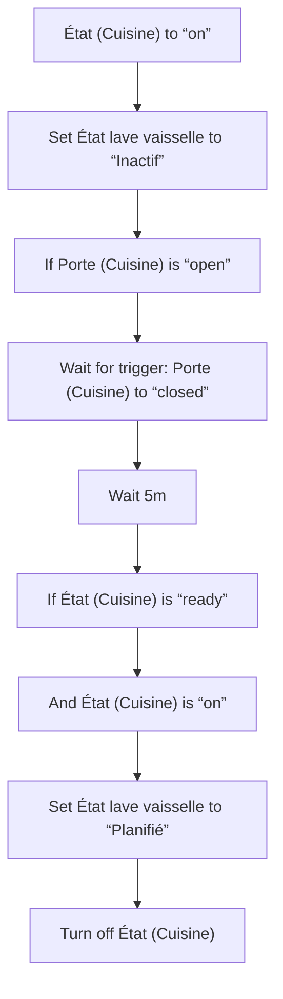
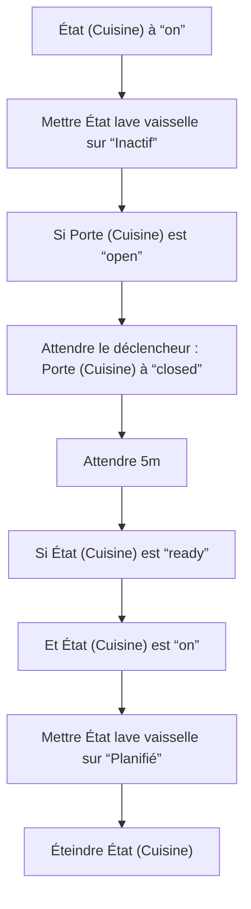

# Lave vaisselle - Planifier lors du démarrage / Lave vaisselle - Planifier lors du démarrage

## English
- Back to guest-friendly view: [smart_dishwasher](../../../aspects/smart_dishwasher.md)
- Back to technical aspect index: [smart_dishwasher](../smart_dishwasher.md)

### Summary
- Runs when: État (Cuisine) to “on”
- Only if: No extra conditions
- Then: Set État lave vaisselle to “Inactif”; If Porte (Cuisine) is “open”; Wait for trigger: Porte (Cuisine) to “closed”; Wait 5m; If État (Cuisine) is “ready”; And État (Cuisine) is “on”; Set État lave vaisselle to “Planifié”; Turn off État (Cuisine)

## Français
- Retour vers la vue “invité” : [smart_dishwasher](../../../aspects/smart_dishwasher.md)
- Retour vers l’index technique de l’aspect : [smart_dishwasher](../smart_dishwasher.md)

### Résumé
- Se déclenche quand : État (Cuisine) à “on”
- Uniquement si : Pas de condition supplémentaire
- Ensuite : Mettre État lave vaisselle sur “Inactif”; Si Porte (Cuisine) est “open”; Attendre le déclencheur : Porte (Cuisine) à “closed”; Attendre 5m; Si État (Cuisine) est “ready”; Et État (Cuisine) est “on”; Mettre État lave vaisselle sur “Planifié”; Éteindre État (Cuisine)

