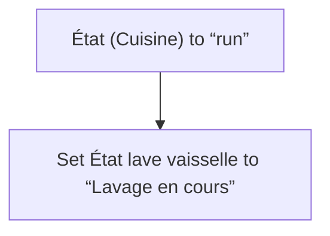
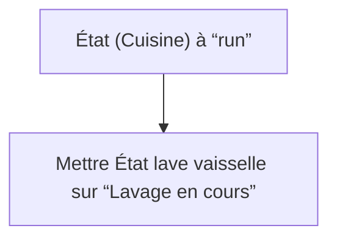

# Lave vaisselle - Lavage en cours / Lave vaisselle - Lavage en cours

## English
- Back to guest-friendly view: [smart_dishwasher](../../../aspects/smart_dishwasher.md)
- Back to technical aspect index: [smart_dishwasher](../smart_dishwasher.md)

### Summary
- Runs when: État (Cuisine) to “run”
- Only if: No extra conditions
- Then: Set État lave vaisselle to “Lavage en cours”

## Français
- Retour vers la vue “invité” : [smart_dishwasher](../../../aspects/smart_dishwasher.md)
- Retour vers l’index technique de l’aspect : [smart_dishwasher](../smart_dishwasher.md)

### Résumé
- Se déclenche quand : État (Cuisine) à “run”
- Uniquement si : Pas de condition supplémentaire
- Ensuite : Mettre État lave vaisselle sur “Lavage en cours”

