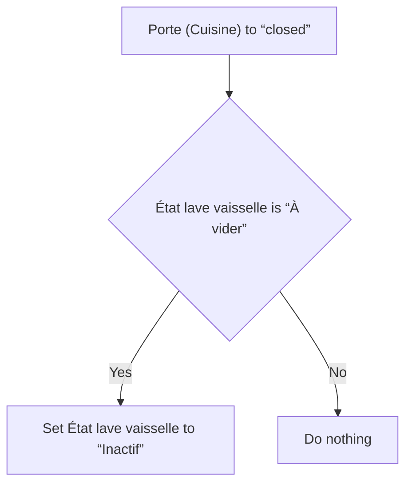
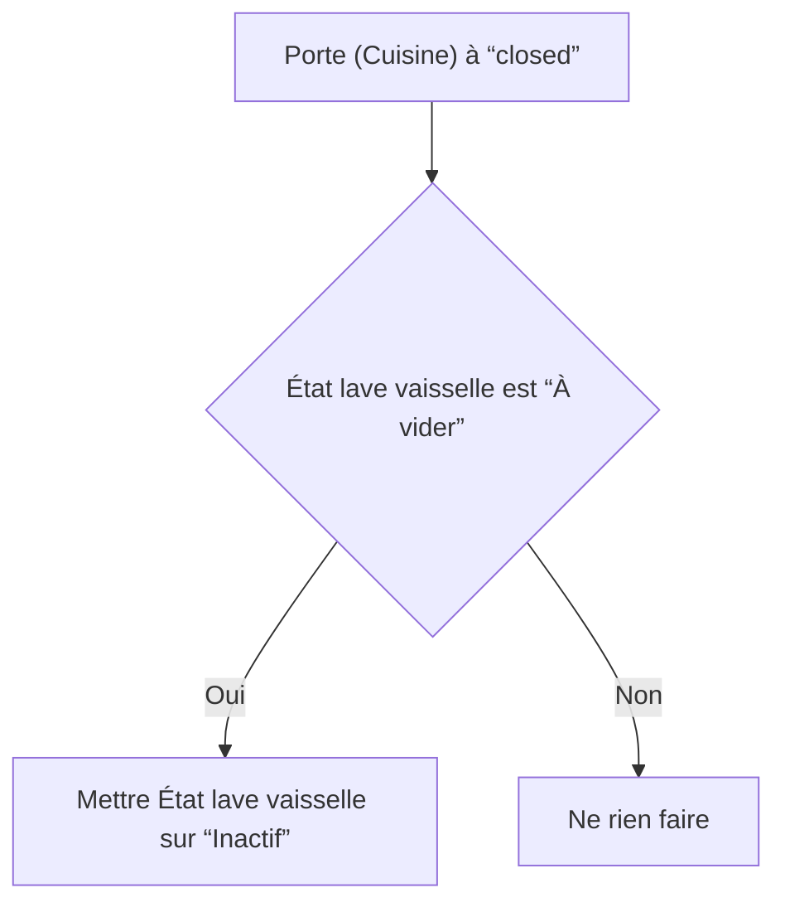

# Lave vaisselle - Lave vaisselle vidé / Lave vaisselle - Lave vaisselle vidé

## English
- Back to guest-friendly view: [smart_dishwasher](../../../aspects/smart_dishwasher.md)
- Back to technical aspect index: [smart_dishwasher](../smart_dishwasher.md)

### Summary
- Runs when: Porte (Cuisine) to “closed”
- Only if: État lave vaisselle is “À vider”
- Then: Set État lave vaisselle to “Inactif”

## Français
- Retour vers la vue “invité” : [smart_dishwasher](../../../aspects/smart_dishwasher.md)
- Retour vers l’index technique de l’aspect : [smart_dishwasher](../smart_dishwasher.md)

### Résumé
- Se déclenche quand : Porte (Cuisine) à “closed”
- Uniquement si : État lave vaisselle est “À vider”
- Ensuite : Mettre État lave vaisselle sur “Inactif”

