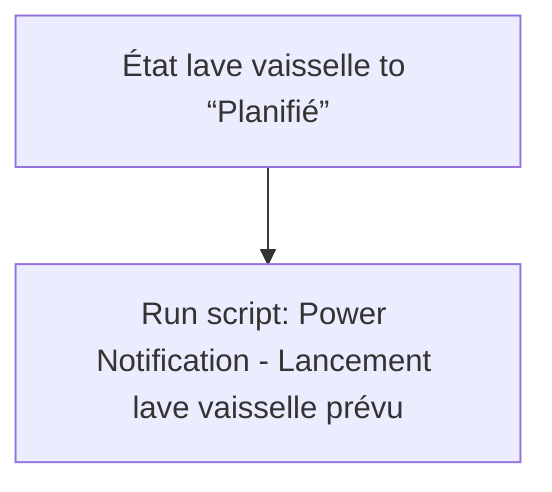
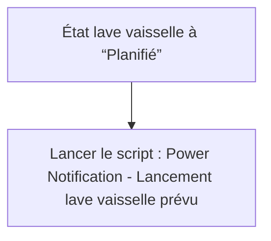

# Lave vaisselle - 🔔 Notifier démarrage prévu / Lave vaisselle - 🔔 Notifier démarrage prévu

## English
- Back to guest-friendly view: [smart_dishwasher](../../../aspects/smart_dishwasher.md)
- Back to technical aspect index: [smart_dishwasher](../smart_dishwasher.md)

### Summary
- Runs when: État lave vaisselle to “Planifié”
- Only if: No extra conditions
- Then: Run script: Power Notification - Lancement lave vaisselle prévu

### Scripts called
- [Power Notification - Lancement lave vaisselle prévu](../../scripts/power_notification_lancement_lave_vaisselle_prevu.md)

## Français
- Retour vers la vue “invité” : [smart_dishwasher](../../../aspects/smart_dishwasher.md)
- Retour vers l’index technique de l’aspect : [smart_dishwasher](../smart_dishwasher.md)

### Résumé
- Se déclenche quand : État lave vaisselle à “Planifié”
- Uniquement si : Pas de condition supplémentaire
- Ensuite : Lancer le script : Power Notification - Lancement lave vaisselle prévu

### Scripts appelés
- [Power Notification - Lancement lave vaisselle prévu](../../scripts/power_notification_lancement_lave_vaisselle_prevu.md)

