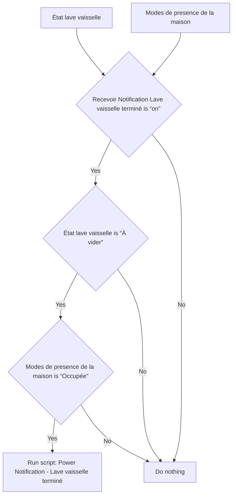
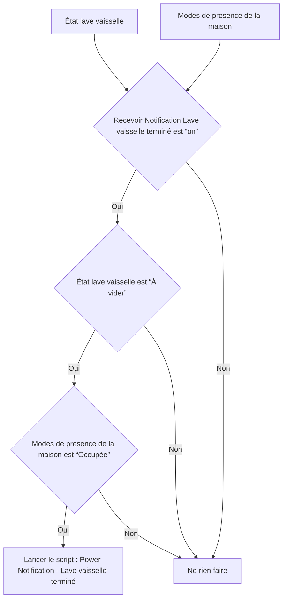

# Lave vaisselle - 🔔 Notifier cycle terminé / Lave vaisselle - 🔔 Notifier cycle terminé

## English
- Back to guest-friendly view: [smart_dishwasher](../../../aspects/smart_dishwasher.md)
- Back to technical aspect index: [smart_dishwasher](../smart_dishwasher.md)

### Summary
- Runs when: État lave vaisselle; Modes de presence de la maison
- Only if: Recevoir Notification Lave vaisselle terminé is “on”; État lave vaisselle is “À vider”; Modes de presence de la maison is “Occupée”
- Then: Run script: Power Notification - Lave vaisselle terminé

### Scripts called
- [Power Notification - Lave vaisselle terminé](../../scripts/power_notification_lave_vaisselle_termine.md)

## Français
- Retour vers la vue “invité” : [smart_dishwasher](../../../aspects/smart_dishwasher.md)
- Retour vers l’index technique de l’aspect : [smart_dishwasher](../smart_dishwasher.md)

### Résumé
- Se déclenche quand : État lave vaisselle; Modes de presence de la maison
- Uniquement si : Recevoir Notification Lave vaisselle terminé est “on”; État lave vaisselle est “À vider”; Modes de presence de la maison est “Occupée”
- Ensuite : Lancer le script : Power Notification - Lave vaisselle terminé

### Scripts appelés
- [Power Notification - Lave vaisselle terminé](../../scripts/power_notification_lave_vaisselle_termine.md)

