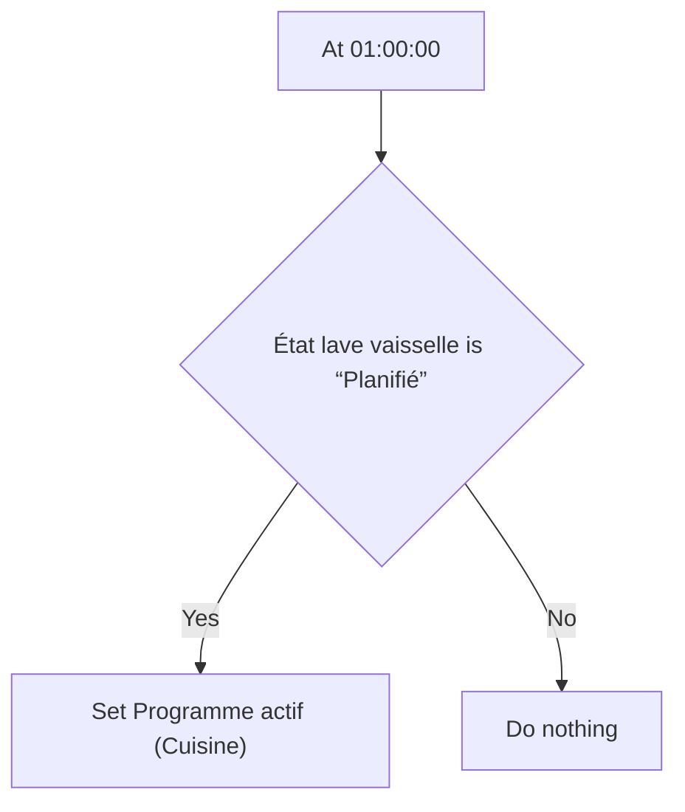
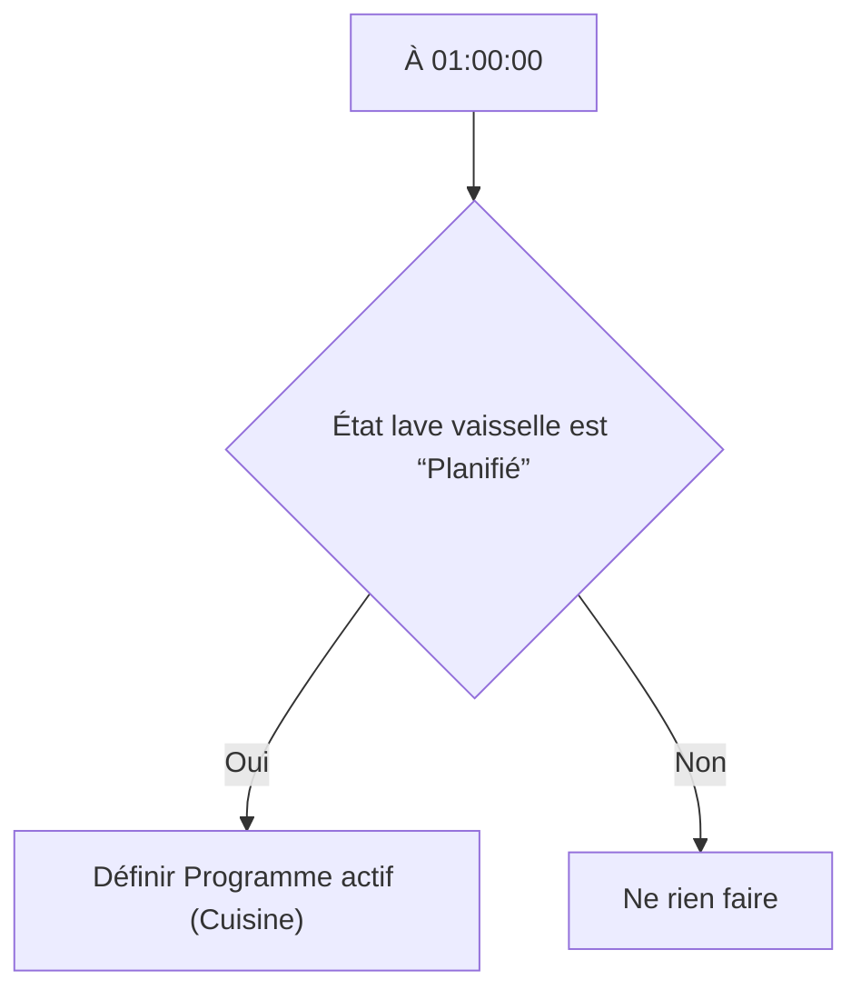

# Lave vaisselle - Lancer à 1:00 / Lave vaisselle - Lancer à 1:00

## English
- Back to guest-friendly view: [smart_dishwasher](../../../aspects/smart_dishwasher.md)
- Back to technical aspect index: [smart_dishwasher](../smart_dishwasher.md)

### Summary
- Runs when: At 01:00:00
- Only if: État lave vaisselle is “Planifié”
- Then: Set Programme actif (Cuisine)

## Français
- Retour vers la vue “invité” : [smart_dishwasher](../../../aspects/smart_dishwasher.md)
- Retour vers l’index technique de l’aspect : [smart_dishwasher](../smart_dishwasher.md)

### Résumé
- Se déclenche quand : À 01:00:00
- Uniquement si : État lave vaisselle est “Planifié”
- Ensuite : Définir Programme actif (Cuisine)

