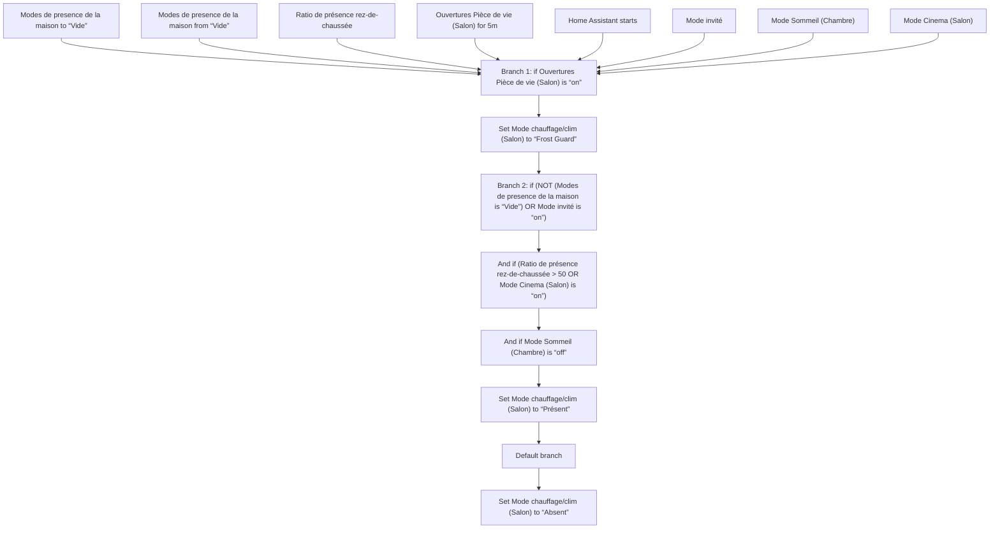
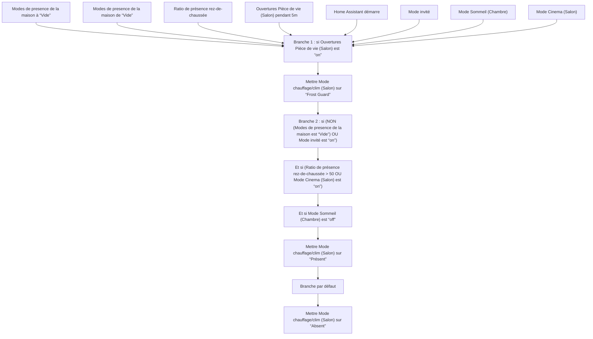

# Chauffage Intelligent - Choisir Mode Rez-De-Chaussée / Chauffage Intelligent - Choisir Mode Rez-De-Chaussée

## English
- Back to guest-friendly view: [smart_heating](../../../aspects/smart_heating.md)
- Back to technical aspect index: [smart_heating](../smart_heating.md)

### Summary
- Runs when: Modes de presence de la maison to “Vide”; Modes de presence de la maison from “Vide”; Ratio de présence rez-de-chaussée; Ouvertures Pièce de vie (Salon) for 5m; Home Assistant starts; Mode invité; Mode Sommeil (Chambre); Mode Cinema (Salon)
- Only if: No extra conditions
- Then: Branch 1: if Ouvertures Pièce de vie (Salon) is “on”; Set Mode chauffage/clim (Salon) to “Frost Guard”; Branch 2: if (NOT (Modes de presence de la maison is “Vide”) OR Mode invité is “on”); And if (Ratio de présence rez-de-chaussée > 50 OR Mode Cinema (Salon) is “on”); And if Mode Sommeil (Chambre) is “off”; Set Mode chauffage/clim (Salon) to “Présent”; Default branch; Set Mode chauffage/clim (Salon) to “Absent”

## Français
- Retour vers la vue “invité” : [smart_heating](../../../aspects/smart_heating.md)
- Retour vers l’index technique de l’aspect : [smart_heating](../smart_heating.md)

### Résumé
- Se déclenche quand : Modes de presence de la maison à “Vide”; Modes de presence de la maison de “Vide”; Ratio de présence rez-de-chaussée; Ouvertures Pièce de vie (Salon) pendant 5m; Home Assistant démarre; Mode invité; Mode Sommeil (Chambre); Mode Cinema (Salon)
- Uniquement si : Pas de condition supplémentaire
- Ensuite : Branche 1 : si Ouvertures Pièce de vie (Salon) est “on”; Mettre Mode chauffage/clim (Salon) sur “Frost Guard”; Branche 2 : si (NON (Modes de presence de la maison est “Vide”) OU Mode invité est “on”); Et si (Ratio de présence rez-de-chaussée > 50 OU Mode Cinema (Salon) est “on”); Et si Mode Sommeil (Chambre) est “off”; Mettre Mode chauffage/clim (Salon) sur “Présent”; Branche par défaut; Mettre Mode chauffage/clim (Salon) sur “Absent”

