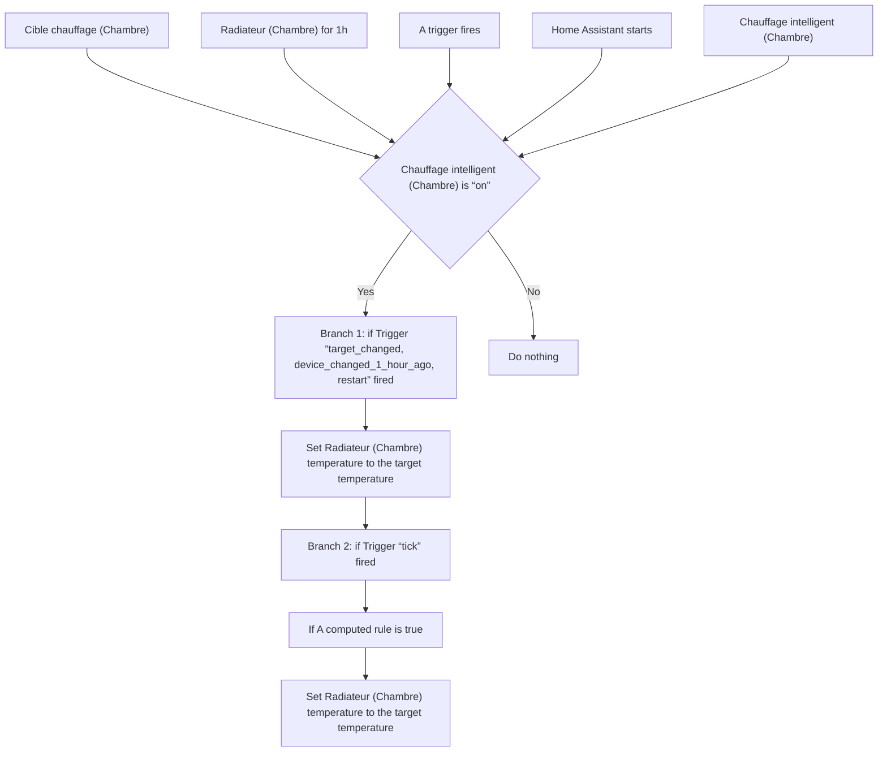
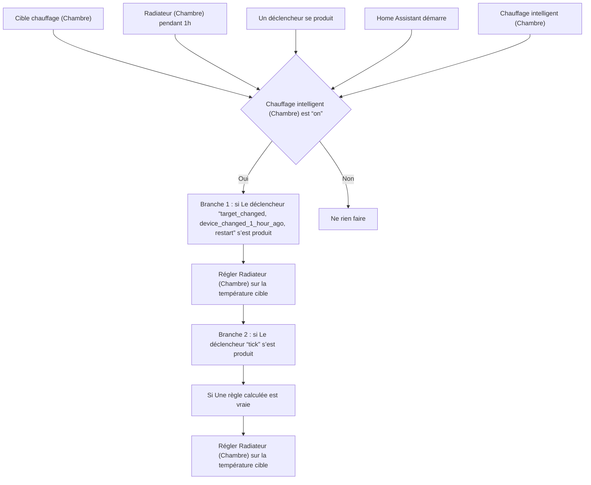

# Chauffage Intelligent - Régler Température Chambre / Chauffage Intelligent - Régler Température Chambre

## English
- Back to guest-friendly view: [smart_heating](../../../aspects/smart_heating.md)
- Back to technical aspect index: [smart_heating](../smart_heating.md)

### Summary
- Runs when: Cible chauffage (Chambre); Radiateur (Chambre) for 1h; A trigger fires; Home Assistant starts; Chauffage intelligent (Chambre)
- Only if: Chauffage intelligent (Chambre) is “on”
- Then: Branch 1: if Trigger “target_changed, device_changed_1_hour_ago, restart” fired; Set Radiateur (Chambre) temperature to the target temperature; Branch 2: if Trigger “tick” fired; If A computed rule is true; Set Radiateur (Chambre) temperature to the target temperature

## Français
- Retour vers la vue “invité” : [smart_heating](../../../aspects/smart_heating.md)
- Retour vers l’index technique de l’aspect : [smart_heating](../smart_heating.md)

### Résumé
- Se déclenche quand : Cible chauffage (Chambre); Radiateur (Chambre) pendant 1h; Un déclencheur se produit; Home Assistant démarre; Chauffage intelligent (Chambre)
- Uniquement si : Chauffage intelligent (Chambre) est “on”
- Ensuite : Branche 1 : si Le déclencheur “target_changed, device_changed_1_hour_ago, restart” s’est produit; Régler Radiateur (Chambre) sur la température cible; Branche 2 : si Le déclencheur “tick” s’est produit; Si Une règle calculée est vraie; Régler Radiateur (Chambre) sur la température cible

