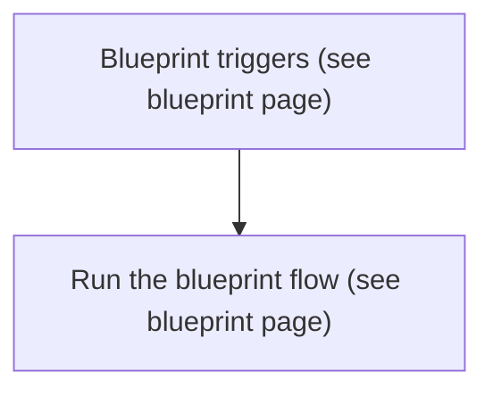
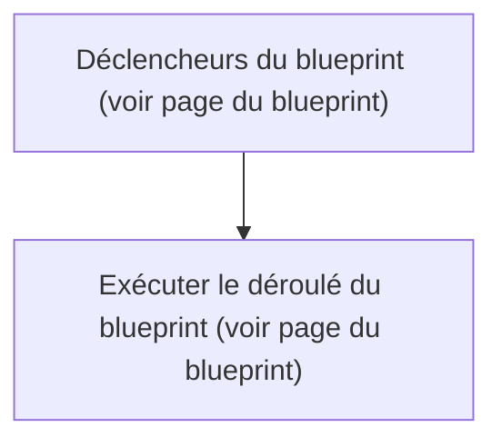

# Chauffage intelligent - 🛎️ Notifier Température anormale Salon / Chauffage intelligent - 🛎️ Notifier Température anormale Salon

## English
- Back to guest-friendly view: [smart_heating](../../../aspects/smart_heating.md)
- Back to technical aspect index: [smart_heating](../smart_heating.md)

- Implemented via blueprint: [perso/notify_abnormal_temperature_v2.yaml](../../blueprints/perso/notify_abnormal_temperature_v2.md)
- For the detailed flow (triggers, logic, branches), see the blueprint page.

### Inputs used
- `outside_temperature`: Station météo Température (Jardin)
- `power_notification_script`: Power Notification - Température anormale dans le salon
- `room_name`: Le salon
- `room_openings`: Ouvertures Pièce de vie (Salon)
- `room_openings_duration`: 00:05:00
- `room_temperature`: Température (Salon)

### Summary
- Runs when: Blueprint triggers (see blueprint page)
- Only if: Blueprint logic allows it (see blueprint page)
- Then: Run the blueprint flow (see blueprint page)

## Français
- Retour vers la vue “invité” : [smart_heating](../../../aspects/smart_heating.md)
- Retour vers l’index technique de l’aspect : [smart_heating](../smart_heating.md)

- Basé sur le blueprint : [perso/notify_abnormal_temperature_v2.yaml](../../blueprints/perso/notify_abnormal_temperature_v2.md)
- Pour le déroulé détaillé (déclencheurs, logique, branches), voir la page du blueprint.

### Entrées utilisées
- `outside_temperature` : Station météo Température (Jardin)
- `power_notification_script` : Power Notification - Température anormale dans le salon
- `room_name` : Le salon
- `room_openings` : Ouvertures Pièce de vie (Salon)
- `room_openings_duration` : 00:05:00
- `room_temperature` : Température (Salon)

### Résumé
- Se déclenche quand : Déclencheurs du blueprint (voir page du blueprint)
- Uniquement si : La logique du blueprint le permet (voir page du blueprint)
- Ensuite : Exécuter le déroulé du blueprint (voir page du blueprint)

