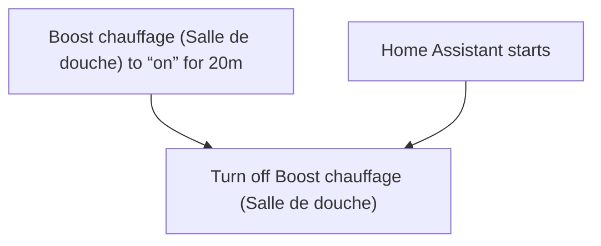
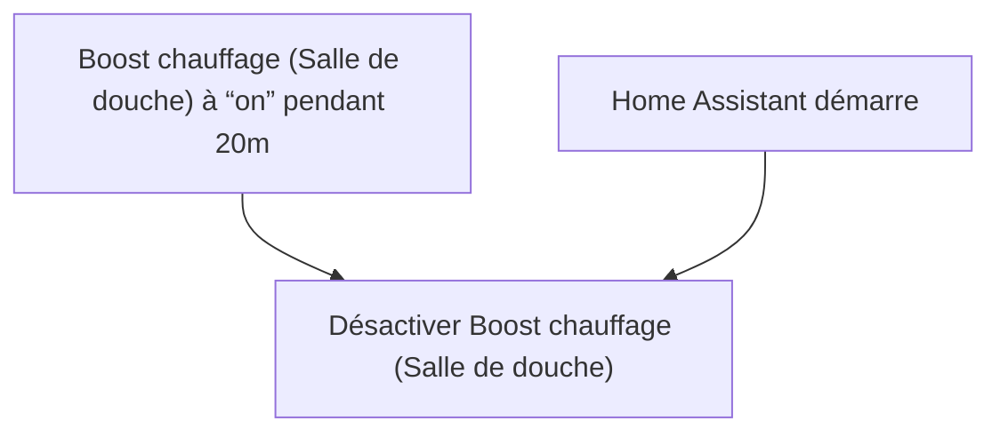

# Chauffage intelligent - Arrêter Boost Salle de Douche / Chauffage intelligent - Arrêter Boost Salle de Douche

## English
- Back to guest-friendly view: [smart_heating](../../../aspects/smart_heating.md)
- Back to technical aspect index: [smart_heating](../smart_heating.md)

### Summary
- Runs when: Boost chauffage (Salle de douche) to “on” for 20m; Home Assistant starts
- Only if: No extra conditions
- Then: Turn off Boost chauffage (Salle de douche)

## Français
- Retour vers la vue “invité” : [smart_heating](../../../aspects/smart_heating.md)
- Retour vers l’index technique de l’aspect : [smart_heating](../smart_heating.md)

### Résumé
- Se déclenche quand : Boost chauffage (Salle de douche) à “on” pendant 20m; Home Assistant démarre
- Uniquement si : Pas de condition supplémentaire
- Ensuite : Désactiver Boost chauffage (Salle de douche)

