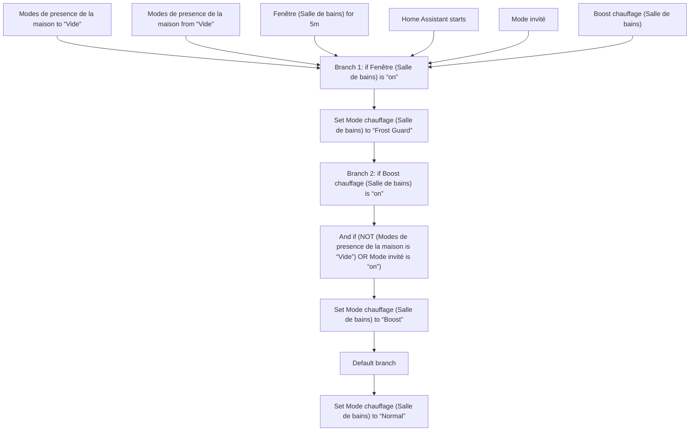
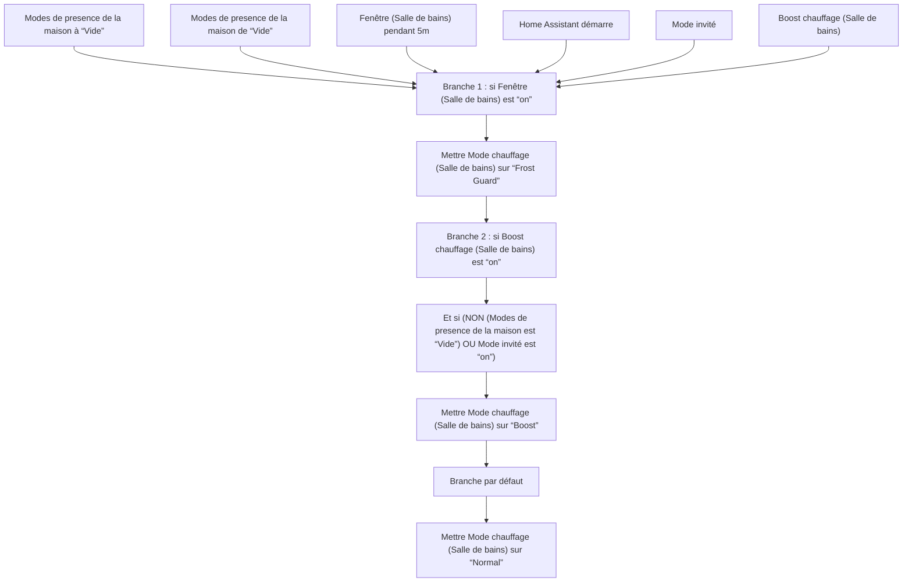

# Chauffage Intelligent - Choisir Mode Salle De Bains / Chauffage Intelligent - Choisir Mode Salle De Bains

## English
- Back to guest-friendly view: [smart_heating](../../../aspects/smart_heating.md)
- Back to technical aspect index: [smart_heating](../smart_heating.md)

### Summary
- Runs when: Modes de presence de la maison to “Vide”; Modes de presence de la maison from “Vide”; Fenêtre (Salle de bains) for 5m; Home Assistant starts; Mode invité; Boost chauffage (Salle de bains)
- Only if: No extra conditions
- Then: Branch 1: if Fenêtre (Salle de bains) is “on”; Set Mode chauffage (Salle de bains) to “Frost Guard”; Branch 2: if Boost chauffage (Salle de bains) is “on”; And if (NOT (Modes de presence de la maison is “Vide”) OR Mode invité is “on”); Set Mode chauffage (Salle de bains) to “Boost”; Default branch; Set Mode chauffage (Salle de bains) to “Normal”

## Français
- Retour vers la vue “invité” : [smart_heating](../../../aspects/smart_heating.md)
- Retour vers l’index technique de l’aspect : [smart_heating](../smart_heating.md)

### Résumé
- Se déclenche quand : Modes de presence de la maison à “Vide”; Modes de presence de la maison de “Vide”; Fenêtre (Salle de bains) pendant 5m; Home Assistant démarre; Mode invité; Boost chauffage (Salle de bains)
- Uniquement si : Pas de condition supplémentaire
- Ensuite : Branche 1 : si Fenêtre (Salle de bains) est “on”; Mettre Mode chauffage (Salle de bains) sur “Frost Guard”; Branche 2 : si Boost chauffage (Salle de bains) est “on”; Et si (NON (Modes de presence de la maison est “Vide”) OU Mode invité est “on”); Mettre Mode chauffage (Salle de bains) sur “Boost”; Branche par défaut; Mettre Mode chauffage (Salle de bains) sur “Normal”

