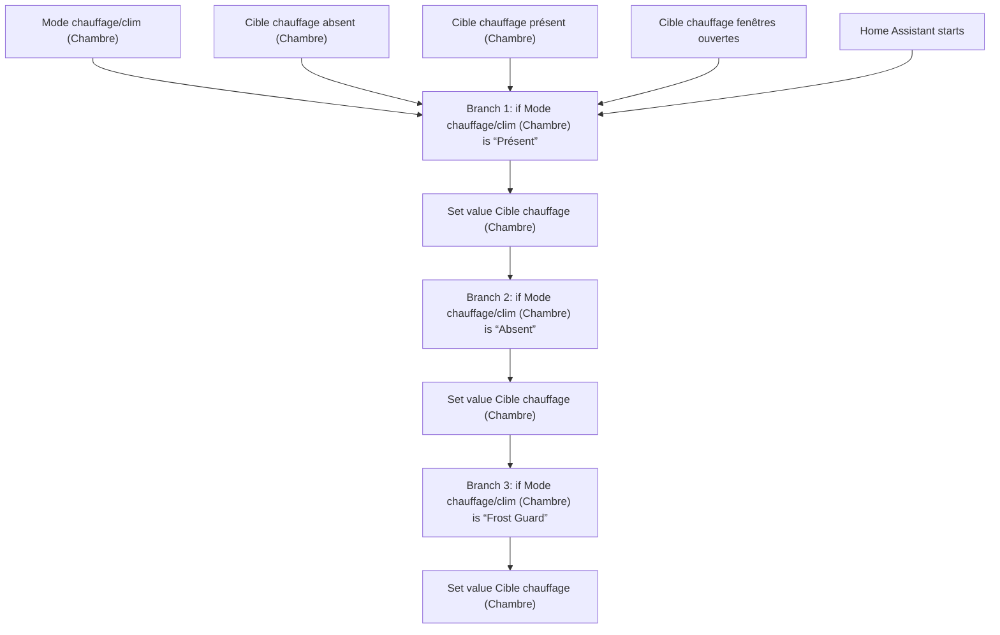
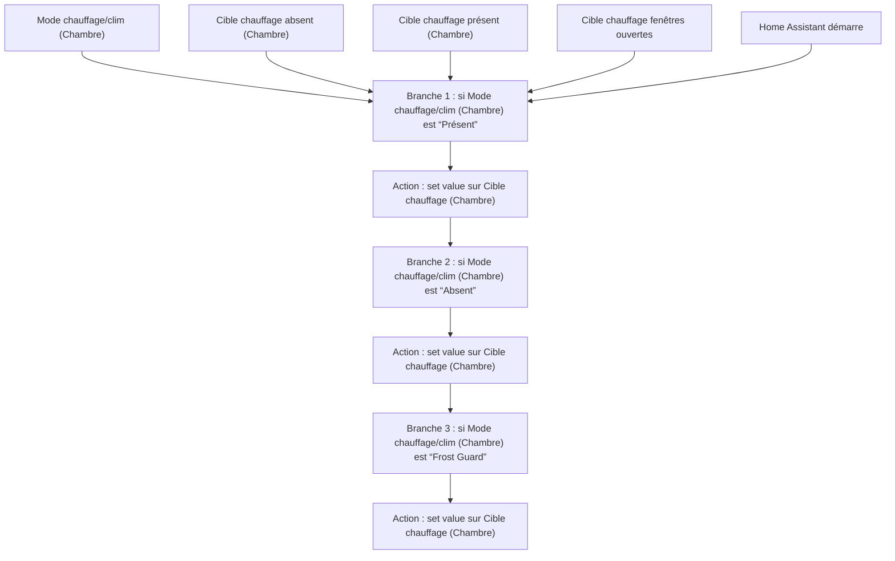

# Chauffage Intelligent - Choisir Temperature Cible Chambre / Chauffage Intelligent - Choisir Temperature Cible Chambre

## English
- Back to guest-friendly view: [smart_heating](../../../aspects/smart_heating.md)
- Back to technical aspect index: [smart_heating](../smart_heating.md)

### Summary
- Runs when: Mode chauffage/clim (Chambre); Cible chauffage absent (Chambre); Cible chauffage présent (Chambre); Cible chauffage fenêtres ouvertes; Home Assistant starts
- Only if: No extra conditions
- Then: Branch 1: if Mode chauffage/clim (Chambre) is “Présent”; Set value Cible chauffage (Chambre); Branch 2: if Mode chauffage/clim (Chambre) is “Absent”; Set value Cible chauffage (Chambre); Branch 3: if Mode chauffage/clim (Chambre) is “Frost Guard”; Set value Cible chauffage (Chambre)

## Français
- Retour vers la vue “invité” : [smart_heating](../../../aspects/smart_heating.md)
- Retour vers l’index technique de l’aspect : [smart_heating](../smart_heating.md)

### Résumé
- Se déclenche quand : Mode chauffage/clim (Chambre); Cible chauffage absent (Chambre); Cible chauffage présent (Chambre); Cible chauffage fenêtres ouvertes; Home Assistant démarre
- Uniquement si : Pas de condition supplémentaire
- Ensuite : Branche 1 : si Mode chauffage/clim (Chambre) est “Présent”; Action : set value sur Cible chauffage (Chambre); Branche 2 : si Mode chauffage/clim (Chambre) est “Absent”; Action : set value sur Cible chauffage (Chambre); Branche 3 : si Mode chauffage/clim (Chambre) est “Frost Guard”; Action : set value sur Cible chauffage (Chambre)

