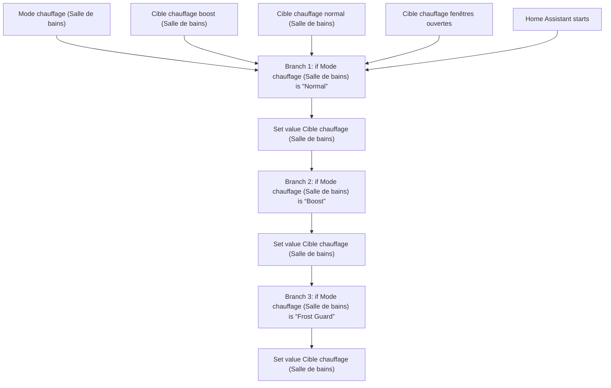
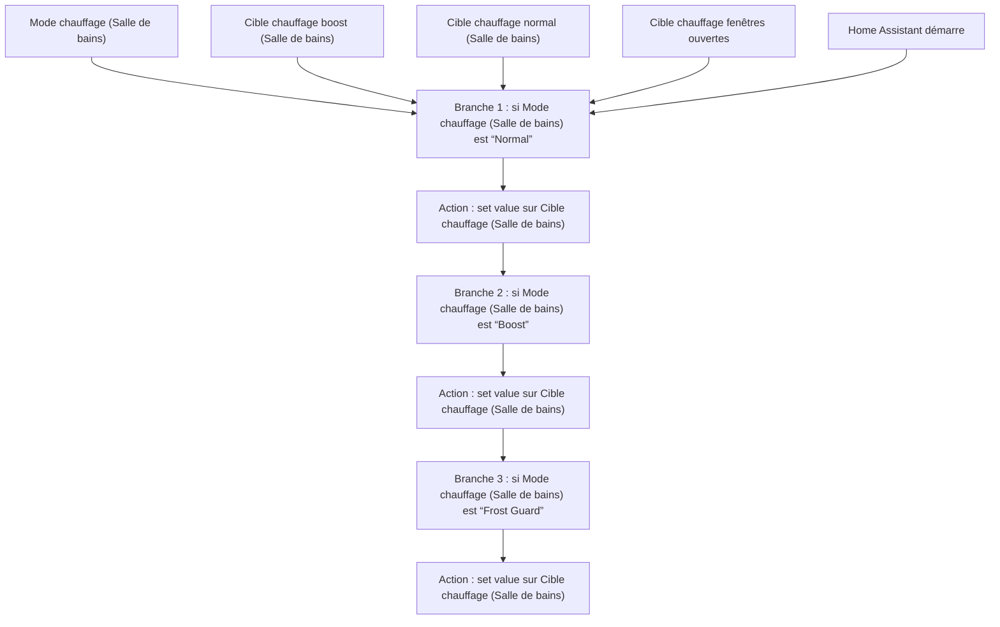

# Chauffage Intelligent - Choisir Temperature Cible Salle De Bains / Chauffage Intelligent - Choisir Temperature Cible Salle De Bains

## English
- Back to guest-friendly view: [smart_heating](../../../aspects/smart_heating.md)
- Back to technical aspect index: [smart_heating](../smart_heating.md)

### Summary
- Runs when: Mode chauffage (Salle de bains); Cible chauffage boost (Salle de bains); Cible chauffage normal (Salle de bains); Cible chauffage fenêtres ouvertes; Home Assistant starts
- Only if: No extra conditions
- Then: Branch 1: if Mode chauffage (Salle de bains) is “Normal”; Set value Cible chauffage (Salle de bains); Branch 2: if Mode chauffage (Salle de bains) is “Boost”; Set value Cible chauffage (Salle de bains); Branch 3: if Mode chauffage (Salle de bains) is “Frost Guard”; Set value Cible chauffage (Salle de bains)

## Français
- Retour vers la vue “invité” : [smart_heating](../../../aspects/smart_heating.md)
- Retour vers l’index technique de l’aspect : [smart_heating](../smart_heating.md)

### Résumé
- Se déclenche quand : Mode chauffage (Salle de bains); Cible chauffage boost (Salle de bains); Cible chauffage normal (Salle de bains); Cible chauffage fenêtres ouvertes; Home Assistant démarre
- Uniquement si : Pas de condition supplémentaire
- Ensuite : Branche 1 : si Mode chauffage (Salle de bains) est “Normal”; Action : set value sur Cible chauffage (Salle de bains); Branche 2 : si Mode chauffage (Salle de bains) est “Boost”; Action : set value sur Cible chauffage (Salle de bains); Branche 3 : si Mode chauffage (Salle de bains) est “Frost Guard”; Action : set value sur Cible chauffage (Salle de bains)

