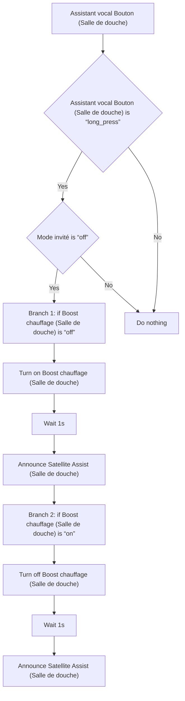
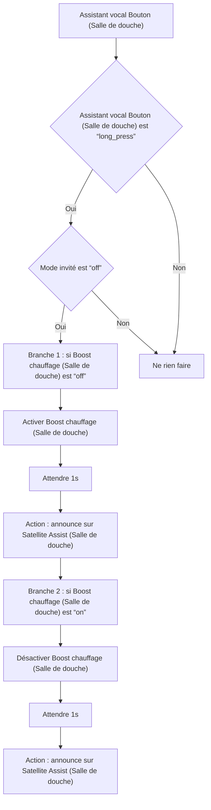

# Boost Salle de Bain - Activer par le VPE / Boost Salle de Bain - Activer par le VPE

## English
- Back to guest-friendly view: [smart_heating](../../../aspects/smart_heating.md)
- Back to technical aspect index: [smart_heating](../smart_heating.md)

### Summary
- Runs when: Assistant vocal Bouton (Salle de douche)
- Only if: Assistant vocal Bouton (Salle de douche) is “long_press”; Mode invité is “off”
- Then: Branch 1: if Boost chauffage (Salle de douche) is “off”; Turn on Boost chauffage (Salle de douche); Wait 1s; Announce Satellite Assist (Salle de douche); Branch 2: if Boost chauffage (Salle de douche) is “on”; Turn off Boost chauffage (Salle de douche); Wait 1s; Announce Satellite Assist (Salle de douche)

## Français
- Retour vers la vue “invité” : [smart_heating](../../../aspects/smart_heating.md)
- Retour vers l’index technique de l’aspect : [smart_heating](../smart_heating.md)

### Résumé
- Se déclenche quand : Assistant vocal Bouton (Salle de douche)
- Uniquement si : Assistant vocal Bouton (Salle de douche) est “long_press”; Mode invité est “off”
- Ensuite : Branche 1 : si Boost chauffage (Salle de douche) est “off”; Activer Boost chauffage (Salle de douche); Attendre 1s; Action : announce sur Satellite Assist (Salle de douche); Branche 2 : si Boost chauffage (Salle de douche) est “on”; Désactiver Boost chauffage (Salle de douche); Attendre 1s; Action : announce sur Satellite Assist (Salle de douche)

