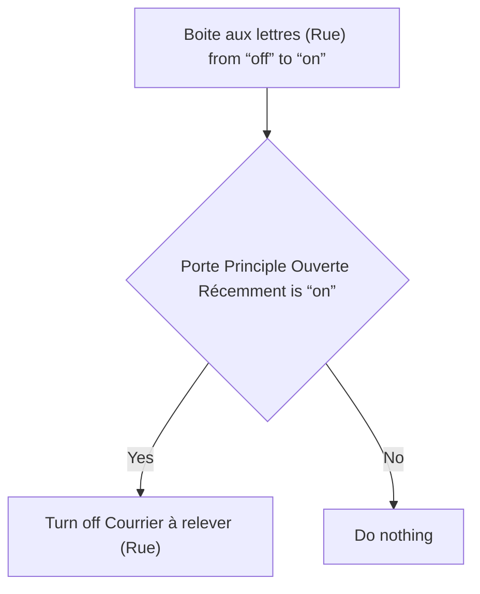
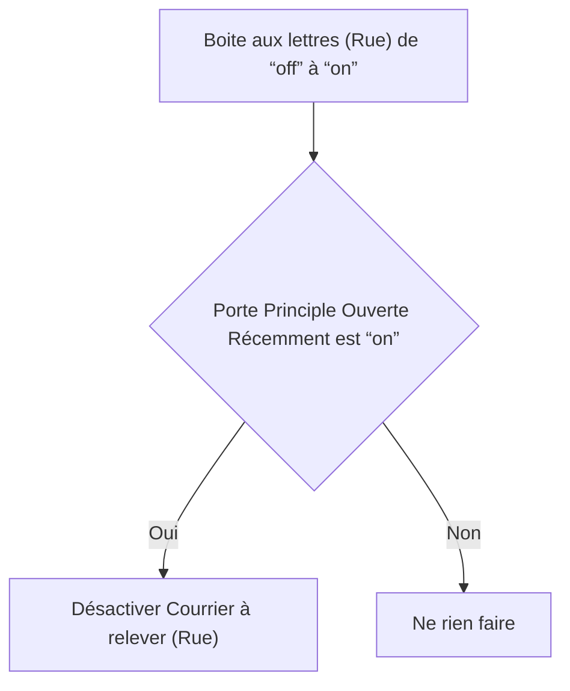

# Boîte aux Lettres Intelligente - Courrier relevé / Boîte aux Lettres Intelligente - Courrier relevé

## English
- Back to guest-friendly view: [smart_mailbox](../../../aspects/smart_mailbox.md)
- Back to technical aspect index: [smart_mailbox](../smart_mailbox.md)

### Summary
- Runs when: Boite aux lettres (Rue) from “off” to “on”
- Only if: Porte Principle Ouverte Récemment is “on”
- Then: Turn off Courrier à relever (Rue)

## Français
- Retour vers la vue “invité” : [smart_mailbox](../../../aspects/smart_mailbox.md)
- Retour vers l’index technique de l’aspect : [smart_mailbox](../smart_mailbox.md)

### Résumé
- Se déclenche quand : Boite aux lettres (Rue) de “off” à “on”
- Uniquement si : Porte Principle Ouverte Récemment est “on”
- Ensuite : Désactiver Courrier à relever (Rue)

