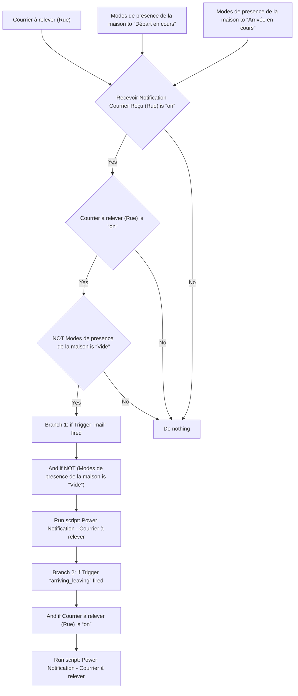
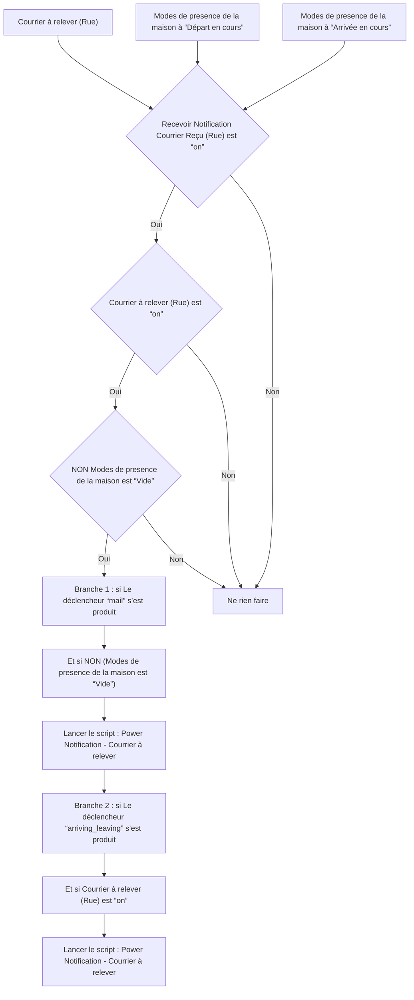

# Boîte aux Lettres Intelligente - 🔔 Notifier / Boîte aux Lettres Intelligente - 🔔 Notifier

## English
- Back to guest-friendly view: [smart_mailbox](../../../aspects/smart_mailbox.md)
- Back to technical aspect index: [smart_mailbox](../smart_mailbox.md)

### Summary
- Runs when: Courrier à relever (Rue); Modes de presence de la maison to “Départ en cours”; Modes de presence de la maison to “Arrivée en cours”
- Only if: Recevoir Notification Courrier Reçu (Rue) is “on”; Courrier à relever (Rue) is “on”; NOT (Modes de presence de la maison is “Vide”)
- Then: Branch 1: if Trigger “mail” fired; And if NOT (Modes de presence de la maison is “Vide”); Run script: Power Notification - Courrier à relever; Branch 2: if Trigger “arriving_leaving” fired; And if Courrier à relever (Rue) is “on”; Run script: Power Notification - Courrier à relever

### Scripts called
- [Power Notification - Courrier à relever](../../scripts/power_notification_courrier_a_relever.md)

## Français
- Retour vers la vue “invité” : [smart_mailbox](../../../aspects/smart_mailbox.md)
- Retour vers l’index technique de l’aspect : [smart_mailbox](../smart_mailbox.md)

### Résumé
- Se déclenche quand : Courrier à relever (Rue); Modes de presence de la maison à “Départ en cours”; Modes de presence de la maison à “Arrivée en cours”
- Uniquement si : Recevoir Notification Courrier Reçu (Rue) est “on”; Courrier à relever (Rue) est “on”; NON (Modes de presence de la maison est “Vide”)
- Ensuite : Branche 1 : si Le déclencheur “mail” s’est produit; Et si NON (Modes de presence de la maison est “Vide”); Lancer le script : Power Notification - Courrier à relever; Branche 2 : si Le déclencheur “arriving_leaving” s’est produit; Et si Courrier à relever (Rue) est “on”; Lancer le script : Power Notification - Courrier à relever

### Scripts appelés
- [Power Notification - Courrier à relever](../../scripts/power_notification_courrier_a_relever.md)

