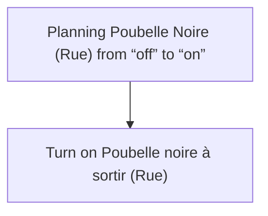
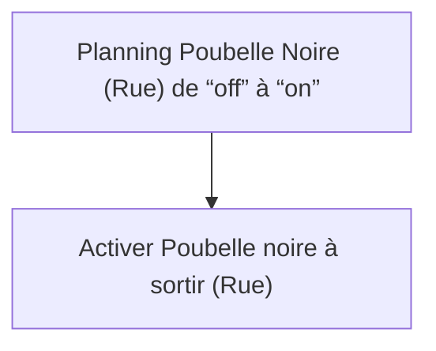

# Poubelles Intelligentes - Poubelle noire à sortir / Poubelles Intelligentes - Poubelle noire à sortir

## English
- Back to guest-friendly view: [smart_trash](../../../aspects/smart_trash.md)
- Back to technical aspect index: [smart_trash](../smart_trash.md)

### Summary
- Runs when: Planning Poubelle Noire (Rue) from “off” to “on”
- Only if: No extra conditions
- Then: Turn on Poubelle noire à sortir (Rue)

## Français
- Retour vers la vue “invité” : [smart_trash](../../../aspects/smart_trash.md)
- Retour vers l’index technique de l’aspect : [smart_trash](../smart_trash.md)

### Résumé
- Se déclenche quand : Planning Poubelle Noire (Rue) de “off” à “on”
- Uniquement si : Pas de condition supplémentaire
- Ensuite : Activer Poubelle noire à sortir (Rue)

