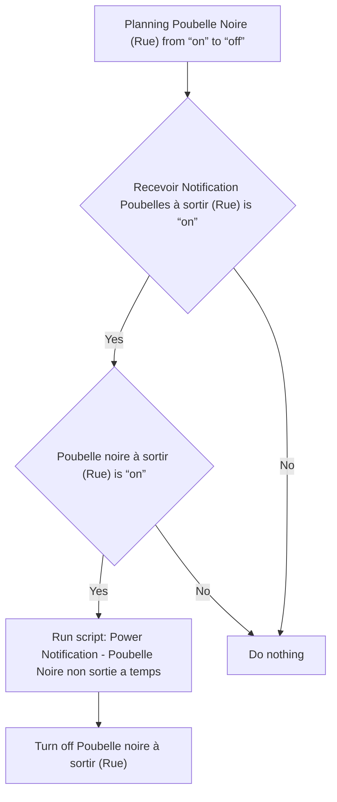
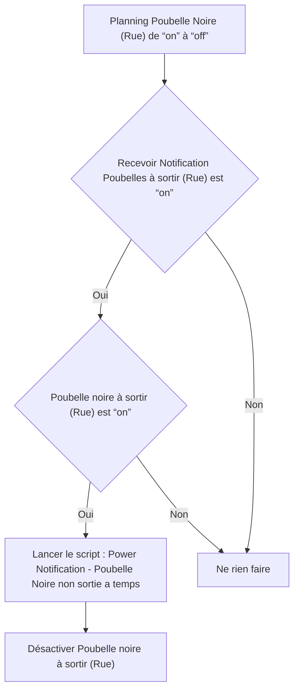

# Poubelles Intelligentes - 🔔 Poubelle noire non sortie à temps / Poubelles Intelligentes - 🔔 Poubelle noire non sortie à temps

## English
- Back to guest-friendly view: [smart_trash](../../../aspects/smart_trash.md)
- Back to technical aspect index: [smart_trash](../smart_trash.md)

### Summary
- Runs when: Planning Poubelle Noire (Rue) from “on” to “off”
- Only if: Recevoir Notification Poubelles à sortir (Rue) is “on”; Poubelle noire à sortir (Rue) is “on”
- Then: Run script: Power Notification - Poubelle Noire non sortie a temps; Turn off Poubelle noire à sortir (Rue)

### Scripts called
- [Power Notification - Poubelle Noire non sortie a temps](../../scripts/power_notification_poubelle_noire_non_sortie_a_temps.md)

## Français
- Retour vers la vue “invité” : [smart_trash](../../../aspects/smart_trash.md)
- Retour vers l’index technique de l’aspect : [smart_trash](../smart_trash.md)

### Résumé
- Se déclenche quand : Planning Poubelle Noire (Rue) de “on” à “off”
- Uniquement si : Recevoir Notification Poubelles à sortir (Rue) est “on”; Poubelle noire à sortir (Rue) est “on”
- Ensuite : Lancer le script : Power Notification - Poubelle Noire non sortie a temps; Désactiver Poubelle noire à sortir (Rue)

### Scripts appelés
- [Power Notification - Poubelle Noire non sortie a temps](../../scripts/power_notification_poubelle_noire_non_sortie_a_temps.md)

