```mermaid
flowchart TD
  T1["Planning Poubelle Verte (Rue) de “on” à “off”"]
  A2["Lancer le script : Power Notification - Poubelle Verte non sortie a temps"]
  A3["Désactiver Poubelle verte à sortir (Rue)"]
  X["Ne rien faire"]
  A2 --> A3
  C4{"Poubelle verte à sortir (Rue) est “on”"}
  C4 -->|Oui| A2
  C4 -->|Non| X
  C5{"Recevoir Notification Poubelles à sortir (Rue) est “on”"}
  C5 -->|Oui| C4
  C5 -->|Non| X
  T1 --> C5
```

# Poubelles Intelligentes - 🔔 Poubelle verte non sortie à temps / Poubelles Intelligentes - 🔔 Poubelle verte non sortie à temps

## English
- Back to guest-friendly view: [smart_trash](../../../aspects/smart_trash.md)
- Back to technical aspect index: [smart_trash](../smart_trash.md)

### Summary
- Runs when: Planning Poubelle Verte (Rue) from “on” to “off”
- Only if: Recevoir Notification Poubelles à sortir (Rue) is “on”; Poubelle verte à sortir (Rue) is “on”
- Then: Run script: Power Notification - Poubelle Verte non sortie a temps; Turn off Poubelle verte à sortir (Rue)

### Scripts called
- [Power Notification - Poubelle Verte non sortie a temps](../../scripts/power_notification_poubelle_verte_non_sortie_a_temps.md)

```mermaid
flowchart TD
  T1["Planning Poubelle Verte (Rue) from “on” to “off”"]
  A2["Run script: Power Notification - Poubelle Verte non sortie a temps"]
  A3["Turn off Poubelle verte à sortir (Rue)"]
  X["Do nothing"]
  A2 --> A3
  C4{"Poubelle verte à sortir (Rue) is “on”"}
  C4 -->|Yes| A2
  C4 -->|No| X
  C5{"Recevoir Notification Poubelles à sortir (Rue) is “on”"}
  C5 -->|Yes| C4
  C5 -->|No| X
  T1 --> C5
```

## Français
- Retour vers la vue “invité” : [smart_trash](../../../aspects/smart_trash.md)
- Retour vers l’index technique de l’aspect : [smart_trash](../smart_trash.md)

### Résumé
- Se déclenche quand : Planning Poubelle Verte (Rue) de “on” à “off”
- Uniquement si : Recevoir Notification Poubelles à sortir (Rue) est “on”; Poubelle verte à sortir (Rue) est “on”
- Ensuite : Lancer le script : Power Notification - Poubelle Verte non sortie a temps; Désactiver Poubelle verte à sortir (Rue)

### Scripts appelés
- [Power Notification - Poubelle Verte non sortie a temps](../../scripts/power_notification_poubelle_verte_non_sortie_a_temps.md)

