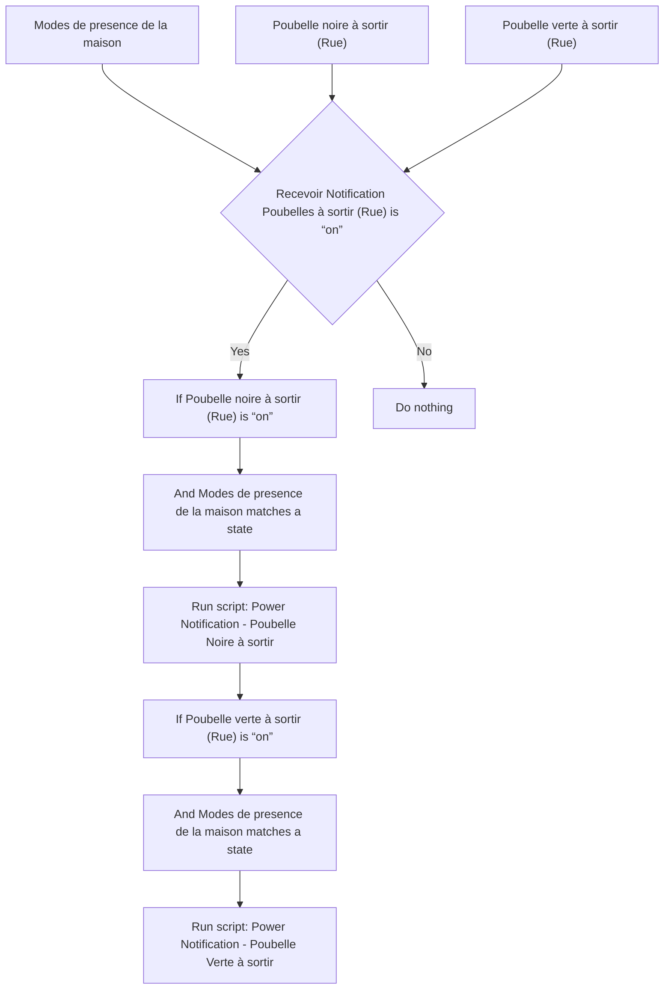
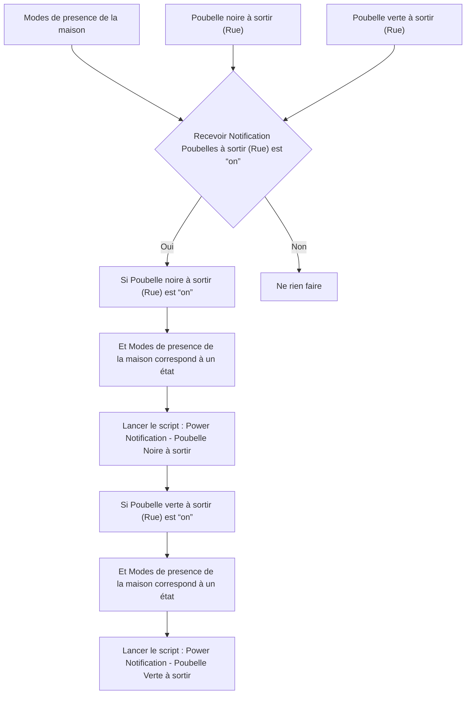

# Poubelles Intelligentes - 🔔 Notifier / Poubelles Intelligentes - 🔔 Notifier

## English
- Back to guest-friendly view: [smart_trash](../../../aspects/smart_trash.md)
- Back to technical aspect index: [smart_trash](../smart_trash.md)

### Summary
- Runs when: Modes de presence de la maison; Poubelle noire à sortir (Rue); Poubelle verte à sortir (Rue)
- Only if: Recevoir Notification Poubelles à sortir (Rue) is “on”
- Then: If Poubelle noire à sortir (Rue) is “on”; And Modes de presence de la maison matches a state; Run script: Power Notification - Poubelle Noire à sortir; If Poubelle verte à sortir (Rue) is “on”; And Modes de presence de la maison matches a state; Run script: Power Notification - Poubelle Verte à sortir

### Scripts called
- [Power Notification - Poubelle Noire à sortir](../../scripts/power_notification_poubelle_noire_a_sortir.md)
- [Power Notification - Poubelle Verte à sortir](../../scripts/power_notification_poubelle_verte_a_sortir.md)

## Français
- Retour vers la vue “invité” : [smart_trash](../../../aspects/smart_trash.md)
- Retour vers l’index technique de l’aspect : [smart_trash](../smart_trash.md)

### Résumé
- Se déclenche quand : Modes de presence de la maison; Poubelle noire à sortir (Rue); Poubelle verte à sortir (Rue)
- Uniquement si : Recevoir Notification Poubelles à sortir (Rue) est “on”
- Ensuite : Si Poubelle noire à sortir (Rue) est “on”; Et Modes de presence de la maison correspond à un état; Lancer le script : Power Notification - Poubelle Noire à sortir; Si Poubelle verte à sortir (Rue) est “on”; Et Modes de presence de la maison correspond à un état; Lancer le script : Power Notification - Poubelle Verte à sortir

### Scripts appelés
- [Power Notification - Poubelle Noire à sortir](../../scripts/power_notification_poubelle_noire_a_sortir.md)
- [Power Notification - Poubelle Verte à sortir](../../scripts/power_notification_poubelle_verte_a_sortir.md)

