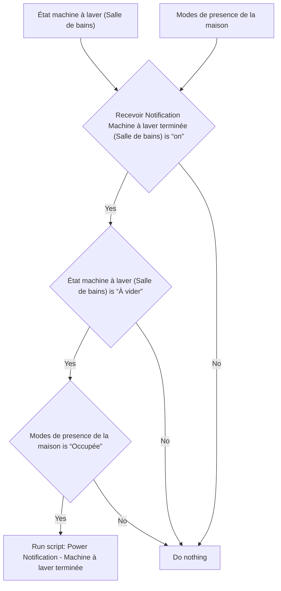
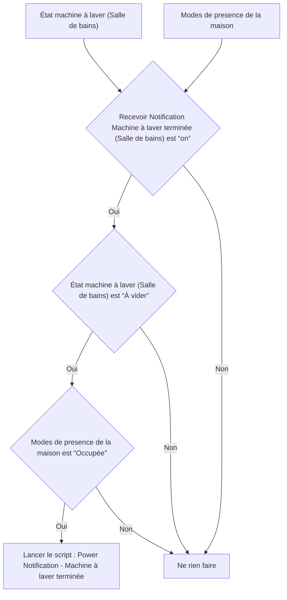

# Machine a Laver - 🔔 Notifier cycle terminé / Machine a Laver - 🔔 Notifier cycle terminé

## English
- Back to guest-friendly view: [smart_washing_machine](../../../aspects/smart_washing_machine.md)
- Back to technical aspect index: [smart_washing_machine](../smart_washing_machine.md)

### Summary
- Runs when: État machine à laver (Salle de bains); Modes de presence de la maison
- Only if: Recevoir Notification Machine à laver terminée (Salle de bains) is “on”; État machine à laver (Salle de bains) is “À vider”; Modes de presence de la maison is “Occupée”
- Then: Run script: Power Notification - Machine à laver terminée

### Scripts called
- [Power Notification - Machine à laver terminée](../../scripts/power_notification_machine_a_laver_terminee.md)

## Français
- Retour vers la vue “invité” : [smart_washing_machine](../../../aspects/smart_washing_machine.md)
- Retour vers l’index technique de l’aspect : [smart_washing_machine](../smart_washing_machine.md)

### Résumé
- Se déclenche quand : État machine à laver (Salle de bains); Modes de presence de la maison
- Uniquement si : Recevoir Notification Machine à laver terminée (Salle de bains) est “on”; État machine à laver (Salle de bains) est “À vider”; Modes de presence de la maison est “Occupée”
- Ensuite : Lancer le script : Power Notification - Machine à laver terminée

### Scripts appelés
- [Power Notification - Machine à laver terminée](../../scripts/power_notification_machine_a_laver_terminee.md)

