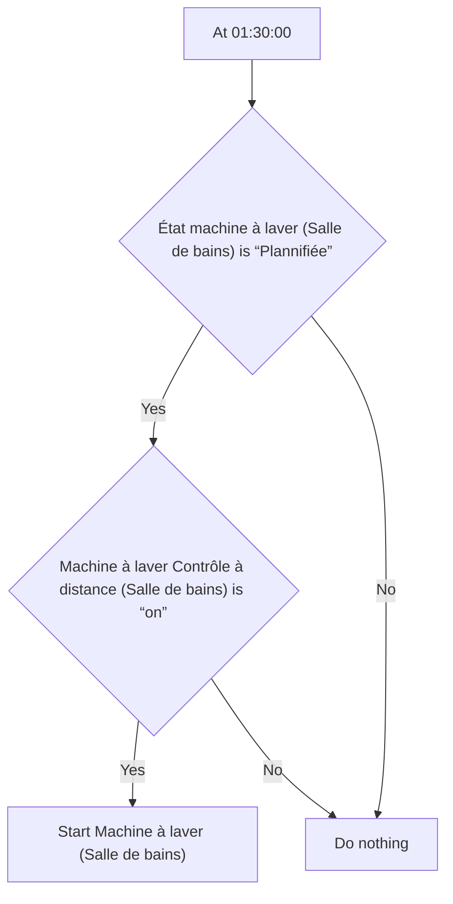
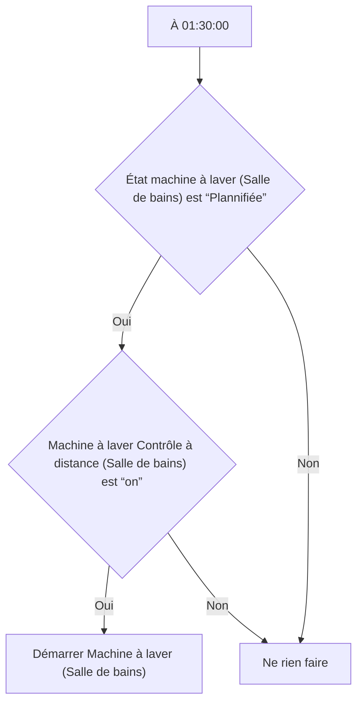

# Machine à laver - Lancer à 1:30 / Machine à laver - Lancer à 1:30

## English
- Back to guest-friendly view: [smart_washing_machine](../../../aspects/smart_washing_machine.md)
- Back to technical aspect index: [smart_washing_machine](../smart_washing_machine.md)

### Summary
- Runs when: At 01:30:00
- Only if: État machine à laver (Salle de bains) is “Plannifiée”; Machine à laver Contrôle à distance (Salle de bains) is “on”
- Then: Start Machine à laver (Salle de bains)

## Français
- Retour vers la vue “invité” : [smart_washing_machine](../../../aspects/smart_washing_machine.md)
- Retour vers l’index technique de l’aspect : [smart_washing_machine](../smart_washing_machine.md)

### Résumé
- Se déclenche quand : À 01:30:00
- Uniquement si : État machine à laver (Salle de bains) est “Plannifiée”; Machine à laver Contrôle à distance (Salle de bains) est “on”
- Ensuite : Démarrer Machine à laver (Salle de bains)

