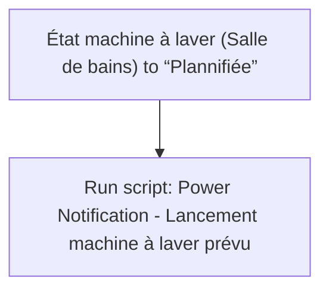
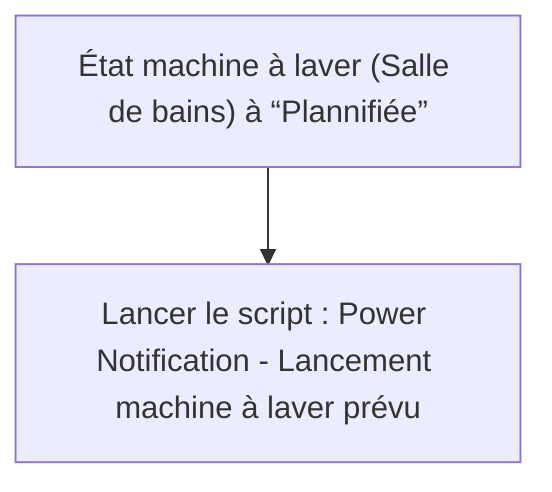

# Machine à laver - 🔔 Notifier démarrage prévu / Machine à laver - 🔔 Notifier démarrage prévu

## English
- Back to guest-friendly view: [smart_washing_machine](../../../aspects/smart_washing_machine.md)
- Back to technical aspect index: [smart_washing_machine](../smart_washing_machine.md)

### Summary
- Runs when: État machine à laver (Salle de bains) to “Plannifiée”
- Only if: No extra conditions
- Then: Run script: Power Notification - Lancement machine à laver prévu

### Scripts called
- [Power Notification - Lancement machine à laver prévu](../../scripts/power_notification_lancement_machine_a_laver_prevu.md)

## Français
- Retour vers la vue “invité” : [smart_washing_machine](../../../aspects/smart_washing_machine.md)
- Retour vers l’index technique de l’aspect : [smart_washing_machine](../smart_washing_machine.md)

### Résumé
- Se déclenche quand : État machine à laver (Salle de bains) à “Plannifiée”
- Uniquement si : Pas de condition supplémentaire
- Ensuite : Lancer le script : Power Notification - Lancement machine à laver prévu

### Scripts appelés
- [Power Notification - Lancement machine à laver prévu](../../scripts/power_notification_lancement_machine_a_laver_prevu.md)

